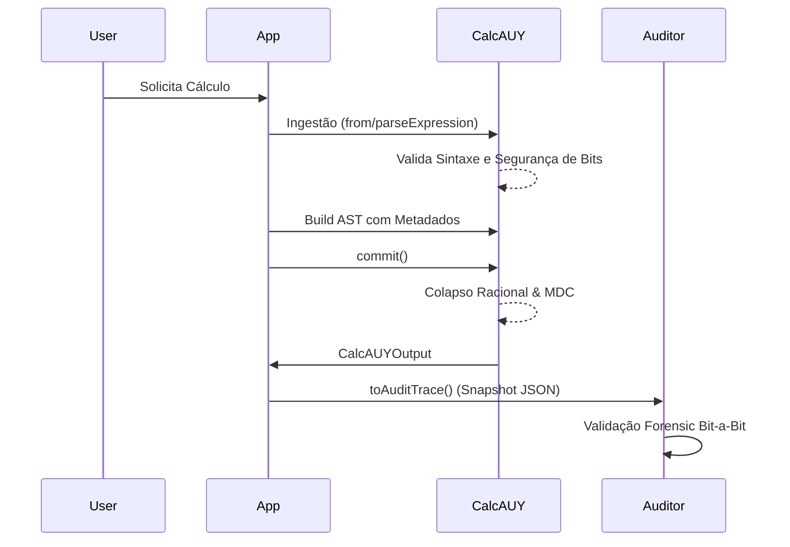

# Segurança, Auditoria e Defesa Jurídica

A CalcAUY foi concebida sob o paradigma da **Auditabilidade Forense**. Isso significa que a biblioteca não apenas protege o sistema contra ataques técnicos, mas também fornece uma blindagem jurídica para as empresas, permitindo que cada centavo seja justificado através de provas matemáticas e trilhas de metadados imutáveis.

---

## 1. Matriz de Proteção Técnica (Ataques e Mitigações)

| Vetor de Ataque | Mecanismo de Defesa | Implementação Técnica |
| :--- | :--- | :--- |
| **BigInt Memory Exhaustion (DoS)** | Bit-Limit Guard | `MAX_BI_BITS = 1.000.000`. Bloqueia a alocação de inteiros gigantescos que poderiam esgotar a RAM do servidor. |
| **Vazamento de PII em Logs** | Redação por Padrão | `setLoggingPolicy({ sensitive: true })`. Todos os valores são substituídos por `[PII]` em logs técnicos, a menos que explicitamente liberados. |
| **Tampering (Manipulação de Dados)** | Hard Immutability | Uso de `#private fields` nativos e retorno de novas instâncias em cada operação. O estado interno de um cálculo é inacessível via mutação. |
| **Injeção de Código (XSS/RCE)** | Lexer Estrito | O `parseExpression()` não usa `eval()` ou `new Function()`. Ele utiliza um Parser de Descida Recursiva que só entende tokens matemáticos. |
| **Hydration Poisoning** | Structural Validation | O método `hydrate()` executa o `validateASTNode()`, verificando tipos e propriedades antes de aceitar uma árvore serializada. |

---

## 2. Segurança Jurídica: O Escudo da Equipe

Em disputas judiciais ou perícias fiscais, o maior risco para um time de engenharia é a acusação de "Caixa Preta". A CalcAUY elimina esse risco através da **Transparência Procedural**.

### Prova Documental Automática
Ao utilizar o método `.toLaTeX()`, a biblioteca gera um memorial de cálculo pronto para ser anexado a laudos.
- **Exemplo de Defesa:** Se um cliente questionar o arredondamento de uma fatura, o rastro LaTeX prova que a biblioteca seguiu a **NBR 5891**, detalhando o ponto exato onde a regra do par foi aplicada.

### Justificativa de Negócio via Metadados
O uso de `.setMetadata()` permite acoplar a **Lei**, o **ID da Regra** ou o **Timestamp** diretamente ao cálculo.
```typescript
// Blindagem jurídica em cálculo de imposto
const icms = CalcAUY.from(base)
  .mult("0.18")
  .setMetadata("lei", "Art. 155 CF/88")
  .setMetadata("regra_id", "BR-TAX-ICMS-SP");
```
*Em uma auditoria, o JSON de auditoria prova que o desenvolvedor não "inventou" o número, mas aplicou uma regra configurada e documentada.*

---

## 3. Fluxo de Auditoria de Dados e Erros

A CalcAUY utiliza o padrão **RFC 7807 (Problem Details)** para erros, garantindo que falhas técnicas contenham contexto sem expor segredos.



---

## 4. Camadas de Telemetria e Ofuscação

### Logs Estruturados
A biblioteca utiliza **LogTape 2.0** com namespaces granulares. Isso permite que você filtre logs de `engine` (construção) separadamente de logs de `output` (exportação).

### Segurança de Logs por Default
1.  **Nível Info:** Registra o nome do método e a duração (ex: `toStringNumber finished in 0.05ms`).
2.  **Nível Debug:** Se `sensitive: false`, exibe a estrutura da AST. Se `true`, exibe a estrutura mas substitui os números por `[REDACTED]`.
3.  **Override Granular:** `node.setMetadata("pii", false)` permite exibir uma constante (ex: "Taxa de 10%") nos logs mesmo que o restante da transação esteja oculto.

---

## 5. Persistência e Recuperação Segura (Hibernação)

O processo de `hibernate()` e `hydrate()` foi desenhado para ser resiliente a corrupção de dados:

-   **Serialização Determinística:** As frações são salvas como strings para evitar perdas de precisão em parsers JSON de diferentes linguagens (ex: um middleware em Python lendo um JSON gerado em Deno).
-   **Validação de Re-entrada:** Ao hidratar, a CalcAUY reavalia as precedências e tipos de nó. Se um atacante alterar o JSON para incluir uma operação inexistente ou um denominador zero, a biblioteca bloqueará a execução antes do processamento.

---

## 6. Estabilidade e Consistência Contínua

A estabilidade é garantida por três pilares de engenharia:
1.  **Pureza Funcional:** O motor de cálculo é puro. Dada a mesma AST, o `commit()` sempre resultará no mesmo numerador e denominador, independente do horário ou estado global do servidor.
2.  **GCD Híbrido:** A simplificação constante evita que cálculos longos degradem a performance por crescimento exponencial de BigInts.
3.  **Late Rounding:** Ao aplicar arredondamento apenas na saída, eliminamos o "drift" (deriva) numérico, garantindo que o rastro de auditoria seja consistente com o resultado financeiro final.

---

## Conclusão de Engenharia
A CalcAUY trata a **Auditabilidade** como uma funcionalidade de primeira classe, não como um log lateral. Cada decisão arquitetural — das Referências Fracas no cache aos Spans de telemetria com `using` — visa construir um sistema onde o desenvolvedor pode dormir tranquilo sabendo que o cálculo é **exato, seguro e juridicamente defensável**.
