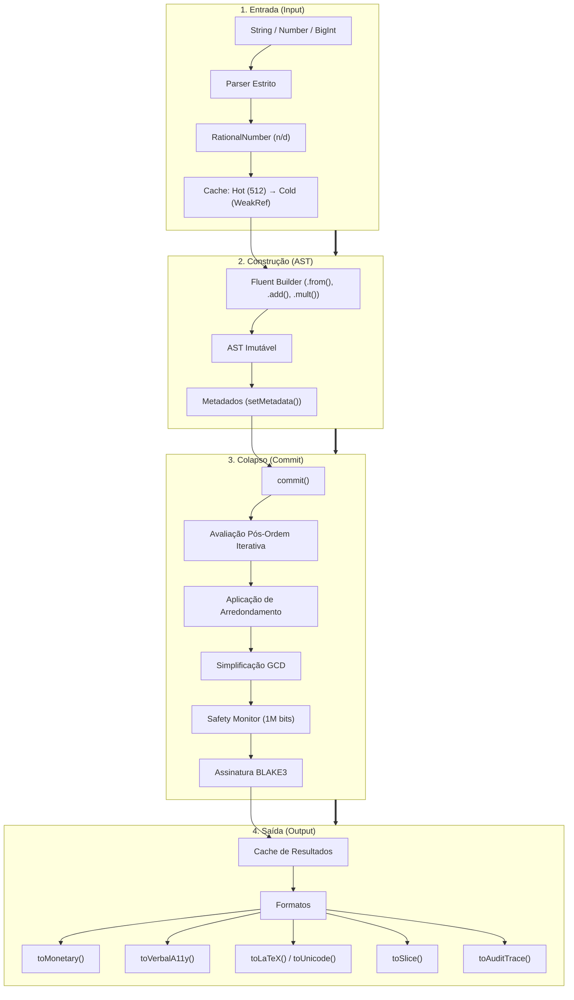
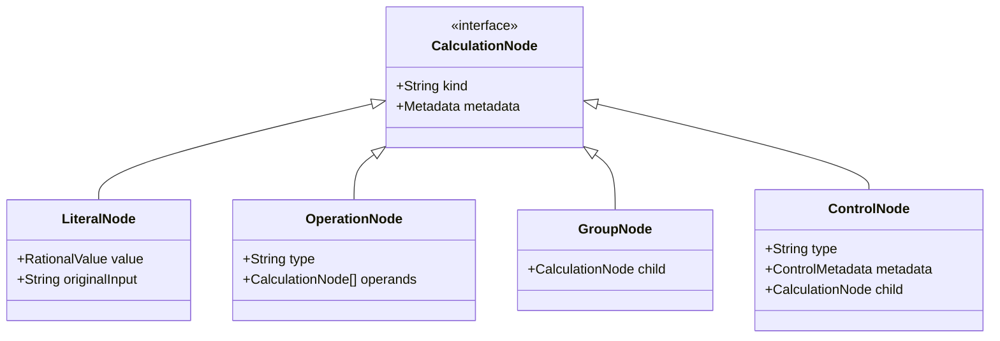

# Arquitetura Interna e Ciclo de Vida

## Visão Geral (4 Lifetimes)

O pipeline da CalcAUY divide o ciclo de vida de um cálculo em quatro estágios distintos, garantindo auditabilidade e precisão racional do input ao arquivamento.

---

## 1. Entrada (Ingestão)

A ingestão converte qualquer entrada em `RationalNumber` (BigInt n/d) **antes** de tocar na engine. Não utiliza `parseFloat()`.

**Métodos de entrada:**

| Método | Descrição |
|--------|-----------|
| `.from(value)` | Aceita `string`, `number`, `bigint`, ou outra instância `CalcAUYLogic` do mesmo contexto |
| `.parseExpression(str)` | Lex → Parser (tokenização + AST a partir de expressão matemática) |
| `.fromExternalInstance(ext)` | Portal seguro para cross-context (via `CalcAUY.create()`) |

**Type guards estritos:** rejeitam `NaN`, `Infinity`, tipos não numéricos, e formatos de string inválidos.

**Cache de nós literais — dois níveis:**

1. **Hot Cache** (`Map`, 512 entradas, referências fortes) — números mais frequentes, O(1) sem overhead de `deref()`
2. **Cold Cache** (`Map` + `WeakRef` + `FinalizationRegistry`) — GC libera nós órfãos automaticamente

> **Não há terceiro nível** (Session Cache foi removido). Apenas Hot + Cold.

---

## 2. Construção (AST)

Nenhum número é somado ou multiplicado neste estágio. O cálculo existe como uma **Árvore de Sintaxe Abstrata (AST) imutável**.

**Builder fluente:** cada operação (`.add()`, `.mult()`, `.div()`, `.pow()`, `.mod()`, `.divInt()`) retorna uma **nova instância** de `CalcAUYLogic`. A árvore anterior permanece intacta.

**Nós da AST:**

| Tipo | Descrição |
|------|-----------|
| `LiteralNode` | Valor numérico + `originalInput` |
| `OperationNode` | Tipo de operação + `operands[]` |
| `GroupNode` | Parênteses explícitos (precedência) |
| `ControlNode` | Reanimation/cross-context (metadata: `previousContextLabel`, `previousSignature`, `previousRoundStrategy`) |

**Metadados:** `.setMetadata(key, value)` anexa contexto semântico a qualquer nó (ex: justificativa legal, ID do contrato, rastro de aprovação). O metadata é armazenado em cadeia prototípica para herança eficiente.

---

## 3. Colapso e Assinatura (Commit)

`commit()` aciona a avaliação em três etapas:

**Avaliação Pós-Ordem Iterativa** percorre a AST das folhas para a raiz usando uma pilha explícita (não recursão), respeitando `MAX_RECURSION_DEPTH` (500).

**Aplicação de arredondamento:** a estratégia configurada (`NBR5891`, `HALF_UP`, `HALF_EVEN`, `TRUNCATE`, `CEIL`, ou `NONE`) é aplicada ao resultado.

**Simplificação GCD:** toda operação aritmética reduz a fração `n/d` ao menor termo via algoritmo de Euclides.

**Safety Monitor:** antes de cada operação, verifica se numerador e denominador excedem 1 milhão de bits. Se sim, lança `math-overflow`.

**Assinatura BLAKE3:** o payload `{ ast, finalResult, roundStrategy }` é serializado via JCS (RFC 8785) e assinado com BLAKE3 + salt da instância. A codificação padrão é `HEX`.

---

## 4. Saída (Output)

`CalcAUYOutput` encapsula o resultado e a AST, com cache interno (`#cache` para precisões, `#outputCache` para formatos).

| Método | Descrição |
|--------|-----------|
| `toStringNumber()` | String decimal com precisão configurável |
| `toScaledBigInt()` | BigInt escalado (ex: 10.50 → 1050n) |
| `toRawInternalNumber()` | `{ n: bigint, d: bigint }` |
| `toMonetary()` | Moeda localizada (sem `Intl.NumberFormat`) |
| `toLaTeX()` | Representação tipográfica |
| `toUnicode()` | Subscrito Unicode (CLI) |
| `toMermaidGraph()` | Diagrama de sequência |
| `toVerbalA11y()` | Narrativa natural para leitores de tela |
| `toSlice()` | Rateio por Maior Resto |
| `toSliceByRatio()` | Rateio proporcional |
| `toAuditTrace()` | JSON assinado completo |
| `toJSON()` | Multi-formato em JSON |
| `toCustomOutput()` | Extensão via processor importado |

> `toFloatNumber()` não existe — não foi implementado.

---

## Representação Interna

**`RationalNumber`**: fração exata `n/d` com `BigInt`, GCD-simplificada em cada operação.

| Propriedade | Valor |
|-------------|-------|
| Precisão interna | 50 casas decimais (`PRECISION_BIGINT = 50n`) |
| Limite de segurança | 1.000.000 bits |
| Cache Hot | 512 entradas |
| Cache Cold | WeakRef + FinalizationRegistry |
| Padrão de arredondamento | `NBR5891` |
| Codificação da assinatura | `HEX` (padrão), `BASE64`, `BASE58`, `BASE32` |

**Imutabilidade:** campos `#n` e `#d` são `#private` — nem mesmo via depuração é possível alterá-los após a criação.

---

## Diagrama de Anatomia de um Nó

---

[↑ Voltar ao índice](./index.md)
