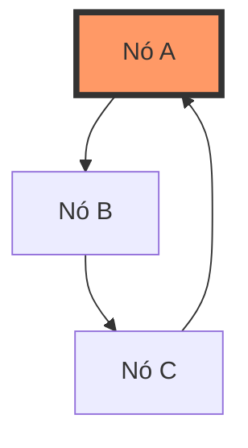

# Erro: `circular-dependency` (422 Unprocessable Entity)



O erro `circular-dependency` ocorre quando a estrutura da Árvore de Sintaxe Abstrata (AST) contém uma referência recursiva a si mesma, criando um loop infinito que impediria o processamento do cálculo.

## 🛠️ Como ocorre

A Fluent API da CalcAUY impede a criação de ciclos por design (sempre gerando novos nós imutáveis). No entanto, este erro pode surgir em cenários de integração de baixo nível:

1.  **Manipulação de JSON:** Ao tentar hidratar um JSON da AST construído manualmente onde um nó aponta para um de seus ancestrais.
2.  **Injeção Via Portal:** Em casos extremos de uso indevido do método `fromExternalInstance()` com objetos compartilhados na memória.
3.  **Bugs de Clonagem:** Falhas em ferramentas externas de clonagem profunda que mantêm referências circulares ao tentar "reparar" a árvore.

## 💻 Exemplo de Código (Cenário Hipotético)

```typescript
// Lança circular-dependency durante a validação no hydrate()
const nodeA: any = { kind: "literal", value: { n: "10", d: "1" } };
const nodeB: any = { kind: "operation", type: "add", operands: [nodeA] };
nodeA.metadata = { parent: nodeB }; // Ciclo criado manualmente

try {
    await instance.hydrate({ ast: nodeB, signature: "..." });
} catch (err) {
    if (err.title === "circular-dependency") {
        console.error("Cálculo impossível: árvore infinita detectada.");
    }
}
```

## ✅ O que fazer

-   **Confie na Fluent API:** Sempre construa seus cálculos utilizando os métodos `.from()`, `.add()`, etc. Eles garantem uma estrutura de Árvore (Grafo Acíclico Dirigido) por construção.
-   **Valide Fontes Externas:** Se estiver construindo a AST via geradores de código, implemente um check de unicidade de referências antes de passar para a CalcAUY.
-   **Evite Referências em Metadados:** Nunca tente armazenar referências de objetos da AST dentro do campo `metadata`.

## 🧠 Reflexão Técnica: Por que tratamos isso como erro crítico?

Uma árvore de cálculo deve ser resolvida de forma linear ou recursiva finita. A presença de um ciclo transformaria a fase de `commit()` (Execução) em um loop infinito, resultando em travamento do processo ou estouro da pilha de execução (Stack Overflow). 

Detectar isso preventivamente na fase de `hydrate()` ou `attachOp()` protege a estabilidade do sistema e garante que o rastro de auditoria seja sempre um caminho finito e periciável. Para a auditoria forense, um cálculo circular é juridicamente nulo, pois não possui um ponto de partida ou fim definido.

---

## 🔗 Veja também
- [**Guia de Estrutura AST**](../internal/ast-architecture.md): Como a árvore é montada.
- [**Erros de Hidratação**](./corrupted-node.md): Outras falhas de reconstrução.
