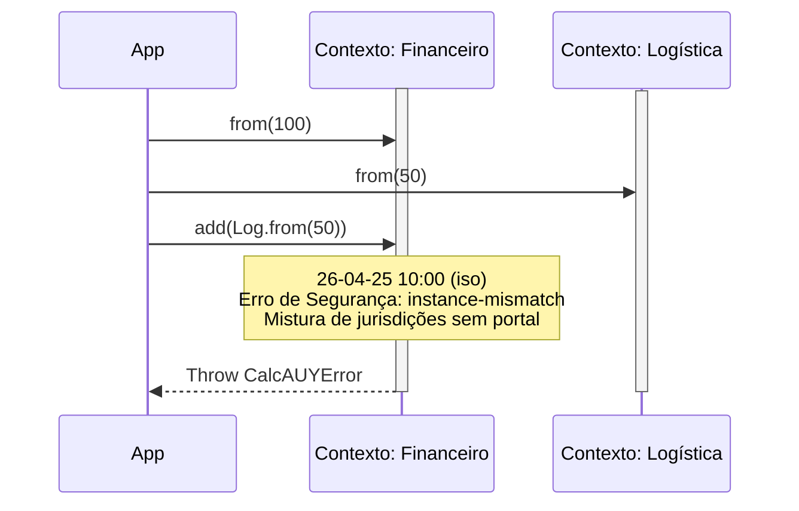

# Erro: `instance-mismatch` (403 Forbidden)



Este erro ocorre quando há uma tentativa de realizar operações matemáticas
 ou de união de árvores entre duas instâncias da `CalcAUYLogic` que pertencem a contextos (jurisdições) diferentes e isolados.

## 🛠️ Como ocorre
1. **Mistura de Contextos:** Tentar somar, subtrair ou multiplicar valores criados em instâncias diferentes (ex: somar um valor da instância "Financeiro" em um cálculo da instância "Logística").
2. **Identidades Únicas:** Mesmo que duas instâncias compartilhem o mesmo `contextLabel`, se foram criadas em chamadas separadas ao `CalcAUY.create()`, elas possuem símbolos de identidade (`Symbol`) únicos e são incompatíveis por design.
3. **Segurança de Jurisdição:** A biblioteca impõe um isolamento militar entre universos de cálculo para garantir que a linhagem dos dados seja matematicamente pura e livre de interferências de outros domínios de negócio.

## 💻 Exemplos de Código

### Exemplo 1: Mistura de Domínios Diferentes
```typescript
const Finance = CalcAUY.create({ contextLabel: "finance" });
const Logistic = CalcAUY.create({ contextLabel: "logistic" });

const taxa = Finance.from(10);
const frete = Logistic.from(100);

// Lança instance-mismatch: domínios incompatíveis
frete.add(taxa); 
```

### Exemplo 2: Instâncias Separadas com Mesmo Label
```typescript
const Calc1 = CalcAUY.create({ contextLabel: "vendas", salt: "S1" });
const Calc2 = CalcAUY.create({ contextLabel: "vendas", salt: "S1" });

const v1 = Calc1.from(50);
const v2 = Calc2.from(50);

// Lança instance-mismatch: embora o label seja igual, as instâncias são distintas
v1.add(v2); 
```

## ✅ O que fazer
- **Use o Portal Cross-Context:** Se você precisa unir dados de jurisdições diferentes, utilize o método `fromExternalInstance()`. Ele validará a integridade externa e carimbará o rastro com um nó de controle que prova a transferência de custódia.
- **Reutilize a Instância:** Para cálculos dentro do mesmo domínio de negócio, certifique-se de utilizar a mesma instância retornada pelo `CalcAUY.create()`.
- **Verifique Salts e Encoders:** Salts ou Encoders diferentes criam universos matemáticos incompatíveis.

## 🧠 Reflexão Técnica: Por que isolamos as instâncias?
A `CalcAUY` é um **Motor de Prova Forense**. O isolamento absoluto garante que um erro de lógica em um módulo (ex: "Descontos") não "contamine" cálculos críticos de outro módulo (ex: "Imposto de Renda").

Se permitíssemos a união livre, um rastro de auditoria poderia conter operações assinadas com segredos (`salts`) diferentes de forma oculta, quebrando a cadeia de custódia. O bloqueio via `instance-mismatch` força a declaração explícita do momento em que um dado cruza uma fronteira de jurisdição.

---

## ⚖️ Protocolo de Integração Cross-Context

Para realizar uniões legítimas entre instâncias, siga este protocolo:

### 1. Handshake de Segurança
O método `fromExternalInstance()` aceita uma instância viva ou um JSON assinado. Ele realiza um "aperto de mão" criptográfico, garantindo que o valor externo é autêntico antes de permitir sua entrada na jurisdição atual.

### 2. Exemplo de Integração Segura
```typescript
const Taxa = Finance.from(0.05); // Contexto A
const Base = Logistic.from(1000); // Contexto B

// O portal cria um nó 'control' na AST preservando a linhagem
const BaseComImposto = await Base.fromExternalInstance(Taxa);
```

### 3. Rastreabilidade de Origem
No `toAuditTrace()`, o sistema incluirá o `previousContextLabel` e a `previousSignature`, permitindo que um auditor rastreie o valor até sua jurisdição original.

---

## 🔗 Veja também
- [**Guia de Erros**](../errors.md): Lista completa de exceções da CalcAUY.
- [**Central de Documentação**](../entrypoint.md): Voltar para a página principal.
