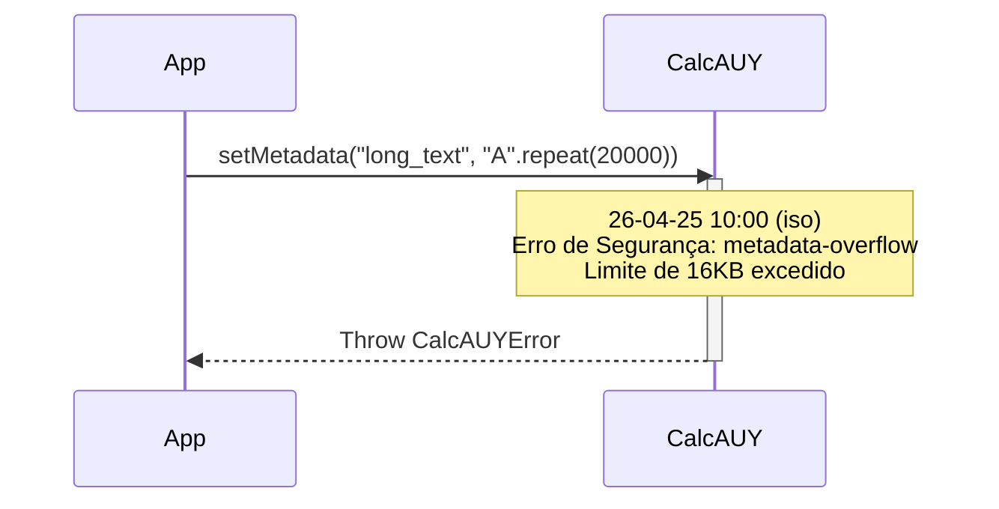

# Erro: `metadata-overflow` (413 Payload Too Large)



O erro `metadata-overflow` ocorre quando o tamanho total dos metadados anexados a um único nó da AST excede o limite de segurança de **16.384 bytes (16KB)**.

## 🛠️ Como ocorre

Este erro é disparado preventivamente pelo método `.setMetadata()` ou durante o `hydrate()` se um payload malicioso for detectado.

1.  **Explosão de Texto:** Tentar salvar textos extremamente longos (como o conteúdo de um contrato inteiro) dentro de um metadado.
2.  **Objetos Complexos:** Anexar objetos profundamente aninhados ou com muitas chaves, onde a soma dos bytes ultrapassa o limite.
3.  **Arrays Massivos:** Listas gigantes de referências ou IDs.

## 💻 Exemplo de Código

```typescript
const Finance = CalcAUY.create({ contextLabel: "audit", salt: "k-1" });

try {
    const hugeData = "X".repeat(20000); // ~40KB em UTF-16
    Finance.from(100).setMetadata("justification", hugeData);
} catch (err) {
    if (err.title === "metadata-overflow") {
        console.error("Payload de metadados muito grande para auditoria.");
    }
}
```

## ✅ O que fazer

-   **Use Referências (IDs):** Em vez de salvar o texto completo de uma lei ou contrato, salve o ID do documento e a URL para a versão específica.
-   **Sanitização de Input:** Se estiver recebendo metadados de fontes externas, valide o tamanho antes de tentar anexar à CalcAUY.
-   **Granularidade:** Distribua os metadados entre diferentes nós da árvore se eles forem logicamente separáveis.

## 🧠 Reflexão Técnica: Por que impomos este limite?

A CalcAUY é uma biblioteca de aritmética forense, não um banco de dados documental. 

Permitir metadados ilimitados abriria brechas para ataques de **Memory Exhaustion (DoS)**. Como a AST é imutável e frequentemente clonada ou serializada para gerar assinaturas, metadados gigantes tornariam as operações de `commit()` e `hibernate()` extremamente lentas e custosas em termos de CPU e memória. O limite de 16KB é um compromisso entre permitir justificativas ricas e manter o desempenho determinístico do motor.

---

## 🔗 Veja também
- [**Guia de Metadados**](../builder-methods/setMetadata.md): Como usar metadados corretamente.
- [**Limites de Segurança**](../internal/security-guards.md): Outros limites técnicos da engine.
