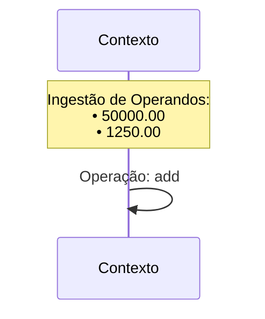
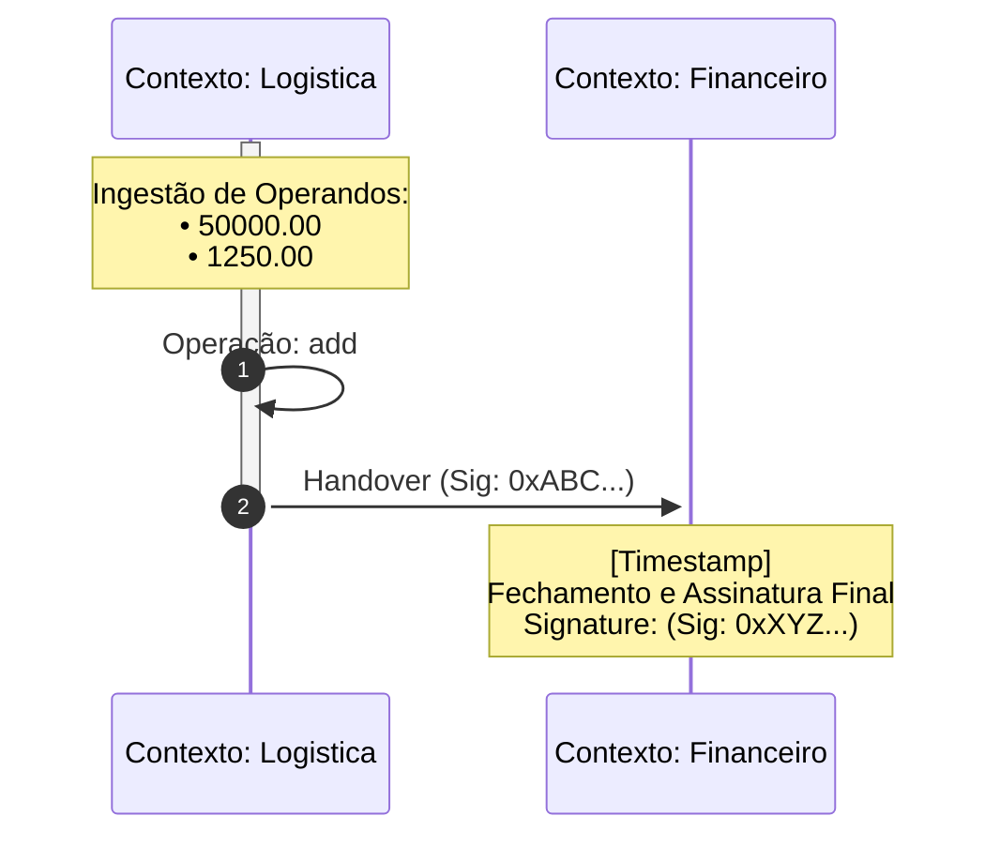

# Rastros de Auditoria

## Estrutura do Audit Trace

O Rastro de Auditoria da CalcAUY é um artefato digital autossuficiente e imutável que prova a origem, a lógica e o resultado de um cálculo. O envelope JSON segue este formato:

```json
{
  "contextLabel": "string",
  "ast": "CalculationNode",
  "finalResult": { "n": "string", "d": "string" },
  "roundStrategy": "string",
  "signature": "string"
}
```

| Campo | Obrigatório | Descrição |
|-------|-------------|-----------|
| `contextLabel` | Sim | Identificador da jurisdição (ex: `"tax-audit-2026"`) |
| `ast` | Sim | Árvore completa de operações (literal, operation, group, control) |
| `finalResult` | Não (ausente em `hibernate`) | Valor racional como strings `n`/`d` para evitar perda de precisão |
| `roundStrategy` | Não (ausente em `hibernate`) | Estratégia de arredondamento aplicada (ex: `NBR5891`) |
| `signature` | Sim | Lacre criptográfico BLAKE3 |

### Contexto da Assinatura

- **`hibernate()`** assina apenas `{ ast }` — garante que a estrutura da árvore não foi alterada
- **`commit()` / `toAuditTrace()`** assina `{ ast, finalResult, roundStrategy }` — garante que o resultado final e a estratégia correspondem à árvore

---

## Ciclo de Vida

### Filosofia "Filme" vs "Foto"

A CalcAUY oferece duas visões complementares do cálculo:

- **Foto (LaTeX/toLaTeX):** Representação estática da fórmula final e seu resultado. Útil para laudos e memorais de cálculo.
- **Filme (Mermaid/toMermaidGraph):** Narrativa cronológica de como o dado foi construído — origem, operações, handovers entre jurisdições, e fechamento com assinatura.

### Criação do Rastro

O rastro é materializado no momento do `commit()`:

```typescript
const calc = CalcAUY.create({ contextLabel: "tax-audit", salt: "S1" })
  .from("1000")
  .add("500")
  .setMetadata("rule", "NBR 5891 §4");

const result = await calc.commit();
// result.toAuditTrace() → envelope JSON assinado
// result.toLiveTrace() → stream de eventos em tempo real
```

### Inspeção

| Método | Saída | Uso |
|--------|-------|-----|
| `toAuditTrace()` | JSON envelope completo com assinatura | Persistência, envio para auditoria |
| `toLiveTrace()` | Sequência de eventos cronológicos | Debug, monitoramento em tempo real |
| `toMermaidGraph(locale)` | Diagrama sequenceDiagram Mermaid | Visualização para auditores |

### Metadados

Cada nó da AST pode conter metadados forenses:

- **Tamanho máximo:** 16.384 bytes (16KB) por nó
- **Tipos permitidos:** Primitivos (string, number, boolean), Arrays, Objetos planos
- **Finalidade:** Justificativa legal, timestamps, IDs de regras, referências a leis/artigos

```typescript
const calc = CalcAUY.create({ contextLabel: "billing", salt: "S1" })
  .from("250.00")
  .setMetadata("law", "Lei 14.973/2024")
  .setMetadata("article", "Art 12 §3")
  .mult("0.18");
```

---

## Mermaid Sequence Ledger

O diagrama Mermaid transforma a AST em uma narrativa visual de livro-razão (ledger).

### Ordenação por Profundidade de Dependência

Para evitar o "Efeito Espaguete" (setas cruzando o diagrama), o motor pré-calcula a profundidade de linhagem:

1. **Consolidador (Raiz):** Profundidade 0 (extrema direita)
2. **Transformadores:** Profundidade N (meio)
3. **Fontes Primárias:** Profundidade máxima (extrema esquerda)

Participantes são declarados em ordem decrescente de profundidade, garantindo fluxo esquerda→direita.

### Gestão de Fadiga Visual

**Agrupamento de operandos:** Nós literais consecutivos no mesmo contexto são acumulados em uma única nota:



**Ativação Sustentada:** A jurisdição permanece ativa durante todo o processamento interno. A barra é aberta (`activate`) no primeiro evento e fechada (`deactivate`) apenas no handover ou encerramento.

### i18n

O rastro visual é 100% sensível ao `locale`. Termos técnicos como "Ingestão", "Operação" e "Handover" são traduzidos conforme o locale configurado.

### Exemplo Forense



### PII no Diagrama

O Mermaid respeita rigorosamente a política `sensitive` da instância e a tag `pii` do nó:

- Valores e metadados sensíveis são substituídos por `[REDACTED]` ou `[PII]`
- Timestamps e assinaturas de handover permanecem visíveis — a cadeia de custódia é verificável mesmo sem acesso aos valores reais

---

## Verificação Forense Manual

Um perito pode validar o rastro sem a biblioteca CalcAUY:

1. Obter o `salt` utilizado no momento da assinatura
2. Re-executar a lógica matemática descrita na `ast` para confirmar o `finalResult`
3. Re-gerar a assinatura via JCS (RFC 8785) + BLAKE3 com o salt
4. Comparar o hash gerado com o campo `signature` do rastro

**Divergência de um único bit em qualquer campo resultará em falha total na verificação.**

---

[↑ Voltar ao índice](../index.md)
