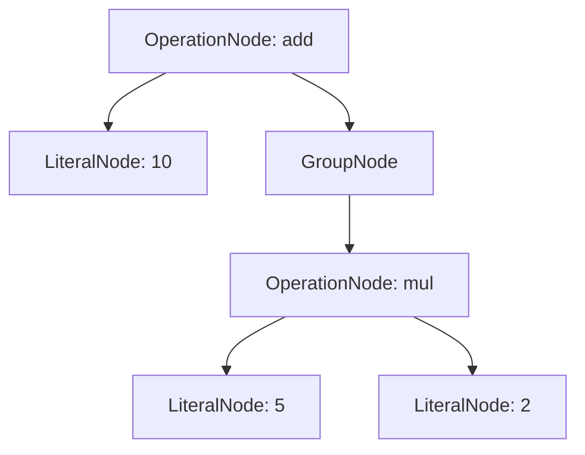

# 02 - Estrutura de Árvore (AST) e Persistência



## Objetivo
Definir uma estrutura de Árvore de Sintaxe Abstrata (AST) que permita a recuperação do cálculo de qualquer ponto (hibernação/hidratação) e suporte auditoria plena sob o motor CalcAUY.

## Definição dos Nós
Cada nó da árvore representa uma operação ou um valor literal. Todos os tipos estão definidos em `src/ast/types.ts`.

### Tipo Fundamental (`BaseNode`)
```ts
type BaseNode = {
    kind: NodeKind; // "literal" | "operation" | "group" | "control"
    metadata?: Record<string, MetadataValue>;
};
```
Metadados não podem conter `null` nem `undefined` — o tipo recursivo `MetadataValue` (`src/ast/types.ts:33-38`) garante serialização JSON segura:
```ts
type MetadataValue =
    | string
    | number
    | boolean
    | MetadataValue[]
    | { [key: string]: MetadataValue };
```

### Tipos de Nós (`CalculationNode`)

O tipo união completo (`src/ast/types.ts:83`):
```ts
type CalculationNode = LiteralNode | OperationNode | GroupNode | ControlNode;
```

1. **LiteralNode:** Representa um valor fixo (`src/ast/types.ts:48-52`).
   - `value: RationalValue` — representação serializável com `{ n: string, d: string }` (BigInt stringificado) (`src/ast/types.ts:24-27`)
   - `originalInput: string` (Nota: Em casos de percentual como "10%", este campo é normalizado para "10/100" para evitar ambiguidades no rastro).
2. **OperationNode:** Representa uma operação entre operandos (`src/ast/types.ts:55-59`).
   - `type: OperationType` — união literal com **8 operações** (`src/ast/types.ts:13-21`):
     ```ts
     type OperationType = "add" | "sub" | "mul" | "div" | "pow" | "mod" | "divInt" | "crossContextAdd";
     ```
   - `operands: CalculationNode[]`
   - A operação `"crossContextAdd"` é usada para integração entre jurisdições via `fromExternalInstance()` (`src/builder.ts:552`), renderizada visualmente como `+` mas semanticamente distinta para auditoria (`src/output_internal/renderer.ts:126,145,163`).
3. **GroupNode:** Representa o agrupamento léxico `(...)` (`src/ast/types.ts:62-65`).
   - `child: CalculationNode`
4. **ControlNode:** Nó de controle para rastreabilidade de jurisdição (`src/ast/types.ts:71-80`).
   ```ts
   type ControlNode = BaseNode & {
       kind: "control";
       type: "reanimation_event";
       metadata: {
           previousContextLabel: string;
           previousSignature: string;
           previousRoundStrategy: string;
       } & Record<string, MetadataValue>;
       child: CalculationNode;
   };
   ```
   - Criado durante `hydrate()` (`src/builder.ts:361`) ou `fromExternalInstance()` (`src/builder.ts:505`) para embrulhar a AST de outra jurisdição, preservando o contexto original para auditoria.

## Serialização e Recuperação
A AST deve ser facilmente conversível para um objeto JSON plano e reconstruível a partir deste.

### Envelope de Serialização (`SerializedCalculation`)
O tipo completo (`src/ast/types.ts:86-97`):
```ts
type SerializedCalculation = {
    ast: CalculationNode;
    signature: string;
    contextLabel: string;
    finalResult?: RationalValue;   // Opcional — presente apenas em traces de auditoria
    roundStrategy?: string;        // Opcional — presente apenas em traces de auditoria
};
```

### Exemplo de JSON (Hibernação)
```json
{
  "type": "add",
  "operands": [
    {
      "type": "literal",
      "value": { "n": "10", "d": "1" }
    },
    {
      "type": "group",
      "child": {
        "type": "mul",
        "operands": [
          { "type": "literal", "value": { "n": "5", "d": "1" } },
          { "type": "literal", "value": { "n": "2", "d": "1" } }
        ]
      }
    }
  ]
}
```

## Metadados de Auditoria
Cada nó pode carregar metadados que auxiliem na reconstrução visual e verbal:
- `metadata?: Record<string, MetadataValue>` (Dados extras de contexto de negócio)
- **Limite de segurança:** `MAX_METADATA_BYTES = 16384` (16KB por nó) em `src/core/constants.ts:53` para evitar ataques de memória via metadados massivos.

## Fluxo de Execução
A AST é construída incrementalmente durante as chamadas de métodos (`add`, `sub`, etc.) ou de uma vez via `parser`. O cálculo real só ocorre quando o nó raiz é "colapsado" através de um método de execução (commit).

---

[↑ Voltar ao índice](../index.md)
