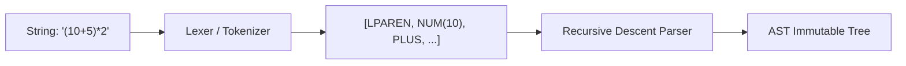

# 03 - Gramática e Regras do Parser



## Objetivo
Transformar expressões em string (ex: `(10 + 5) / 3`) em uma Árvore AST robusta, respeitando o rigor matemático de precedência e identificando erros em tempo de análise através do CalcAUYError.

## Precedência e Associatividade
O parser deve seguir as regras matemáticas padrão (PEMDAS/BODMAS), implementadas via camadas de métodos no `Parser` (`src/parser/parser.ts:27-33`):

```
expr  -> term ( (PLUS | MINUS) term )*          # Associatividade à Esquerda
term  -> unary ( (STAR | SLASH | DOUBLE_SLASH | PERCENT) unary )*  # Associatividade à Esquerda
unary -> (PLUS | MINUS)* power                  # Operadores unários
power -> primary [ CARET power ]                # Associatividade à Direita
primary -> NUMBER | LPAREN expr RPAREN
```

1. **P**arênteses / Grupos — método `primary()` (`src/parser/parser.ts:148`)
2. **E**xponentes (Potência) — **Associatividade à Direita** via recursão em `power()` (`src/parser/parser.ts:130-143`): `2^2^3` = `2^(2^3)`
3. **M**ultiplicação, **D**ivisão, **D**ivisão Inteira (`//`), **M**ódulo (`%`) — **Associatividade à Esquerda** no método `term()` (`src/parser/parser.ts:78-100`)
4. **A**dição e **S**ubtração — **Associatividade à Esquerda** no método `expression()` (`src/parser/parser.ts:59-73`)

### A Regra Crítica da Exponenciação
Diferente da implementação anterior, a nova lib deve tratar `a^b^c` como `a^(b^c)`. O método `power()` (`src/parser/parser.ts:130-143`) chama-se recursivamente após consumir `CARET`, garantindo a associatividade à direita sem necessidade de pilha auxiliar. O rastro de auditoria (LaTeX, Unicode) deve refletir isso explicitamente.

## Tipagem Literal Rigorosa
O lexer (`src/parser/lexer.ts:9-20`) utiliza tipos literais para definir os tokens permitidos:
```ts
type TokenType =
    | "NUMBER" | "PLUS" | "MINUS" | "STAR"
    | "SLASH" | "DOUBLE_SLASH" | "PERCENT"
    | "CARET" | "LPAREN" | "RPAREN" | "EOF";
```

## Reconhecimento de Números no Lexer
O Lexer (`src/parser/lexer.ts:116-152`) reconhece números em notação decimal com `_` como separador visual (ex: `1_000.50`) e suporte a notação científica (`e`, `E`). A validação semântica é reforçada por três expressões regulares em `src/core/rational.ts:41-43`:
- `BIGINT_RE`: `/^[+-]?\d+(?:_\d+)*n?$/` — inteiros BigInt
- `FRACTION_RE`: `/^[+-]?\d+(?:_\d+)*\/[+-]?\d+(?:_\d+)*$/` — frações `n/d`
- `DECIMAL_RE`: `/^[+-]?(?:\d+(?:_\d+)*(?:\.\d+(?:_\d+)*)?|\.\d+(?:_\d+)*)(?:[eE][+-]?\d+(?:_\d+)*)?$/` — decimais

Adicionalmente, `NUMERIC_RE` em `src/utils/sanitizer.ts:20` é usado para detecção de PII em logs:
- `/^[+-]?(?:\d+(?:\.\d*)?|\.\d+)(?:[eE][+-]?\d+)?%?$/`

## Tratamento de Inconsistências e Redundâncias
O parser deve disparar um `CalcAUYError` diante de qualquer uma das seguintes situações:
1. **Redundância de Grupos:** `((10 + 5))` - Identificar e sugerir simplificação ou rejeitar (se configurado como strict).
2. **Operadores Adjacentes Inválidos:** `10 + * 5`.
3. **Parênteses Não Balanceados:** `(10 + 5`.
4. **Expressão Vazia ou Incompleta:** `10 +`.
5. **Formatos Numéricos Ambíguos:** Rejeitar qualquer entrada que não possa ser convertida em um `RationalNumber` sem perda de informação.
6. **Desambiguação de Percentual:** O símbolo `%` pode atuar como operador de módulo (infix: `10 % 3`) ou como sufixo percentual (postfix: `10%`). O Parser utiliza lookahead para decidir: se o `%` não for seguido por um número ou parêntese, ele é tratado como sufixo e converte o literal anterior para `n/100`. Implementação em `src/parser/parser.ts:155-163`:
    ```ts
    if (this.check("PERCENT") && !this.checkNext("NUMBER", "LPAREN")) {
        this.advance(); // Consome o PERCENT como sufixo
        const val = RationalNumber.from(`${token.value}%`);
        // originalInput normalizado para "10/100" no rastro
    }
    ```

## Arquitetura do Parser
- **Lexer:** Transforma a string em uma lista de tokens.
- **Parser (Recursive Descent):** Constrói a árvore AST a partir da lista de tokens, garantindo que a hierarquia de nós respeite as precedências definidas.
- **Validator:** Percorre a árvore recém-criada para identificar redundâncias léxicas antes de retorná-la.

---

[↑ Voltar ao índice](../index.md)
