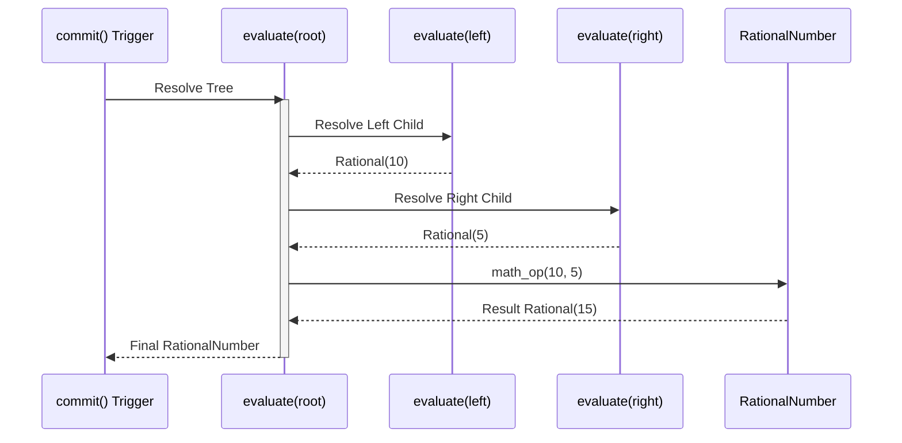

# 04 - Motor de Execução e Arredondamento

## Objetivo
Processar a Árvore AST em um resultado numérico final (`RationalNumber`), garantindo conformidade com regras contábeis e matemáticas rigorosas no motor CalcAUY.

## O Conceito de "Commit"
Diferente da versão anterior, a nova CalcAUY não executa o cálculo matemático a cada chamada de método (`add`, `mult`, etc.). Cada chamada apenas anexa um novo nó à AST.
- **Vantagem:** Permite a serialização do cálculo em qualquer estágio sem perda de precisão e a aplicação correta da ordem das operações no final.

## Arredondamentos Críticos
Para cálculos fiscais e contábeis, a lib deve implementar:
1. **Divisão Inteira Euclidiana:** Onde o resto (`mod`) é sempre positivo, seguindo o Teorema da Divisão de Euclides.
2. **Arredondamentos Fiscais (NBR-5891):** Implementar estratégias como `half-even` (arredondamento bancário) e `half-up` (comercial) apenas no colapso final para o output, mantendo as 50 casas decimais do `RationalNumber` durante todo o processo interno.

## Algoritmo de Colapso (Evaluation)
A função `evaluate(node: CalculationNode): RationalNumber` implementa um motor de execução **iterativo baseado em pilha (Stack-based Evaluation)**. 

Diferente de implementações recursivas, esta abordagem elimina o risco de `Stack Overflow` mesmo em árvores extremamente profundas ou com alta densidade de metadados (que impedem o aplanamento estrutural).

### Funcionamento Interno:
1.  **Pilha de Execução:** O motor mantém uma pilha de nós a processar e uma pilha de resultados parciais.
2.  **Post-order Traversal Iterativo:** A árvore é percorrida garantindo que os operandos sejam resolvidos antes da aplicação do operador.
3.  **Segurança de Profundidade:** Embora não utilize a pilha de chamadas do JavaScript, o motor monitora a profundidade lógica da árvore para evitar loops infinitos ou árvores mal-formadas.

### Otimização de Performance e Telemetria
Durante o colapso, o motor deve confiar na simplificação automática (MDC) do `RationalNumber`. Adicionalmente, as seguintes otimizações são aplicadas:
1. **Telemetry Spans:** O motor utiliza `TelemetrySpan` (Explicit Resource Management) para medir a duração exata do colapso em modo debug, permitindo auditoria de performance granular.
2. **Instance-Level Caching:** O resultado do colapso e as strings de rastro (LaTeX, Unicode, Mermaid) são cacheados na instância do `CalcAUYOutput` após a primeira chamada.
3. **Percurso Único:** Operações complexas como o `commit()` injetam assinaturas digitais BLAKE3 baseadas no estado final da árvore e do resultado, garantindo integridade forense.

## Segurança em Runtime
- **Prevenção de Overflow/Underflow:** Embora o BigInt suporte precisão arbitrária, o motor deve monitorar o tamanho do numerador e denominador para evitar consumo excessivo de memória em dízimas periódicas complexas, forçando o colapso para 50 casas decimais quando necessário (ex: em operações de potência e raízes n-ésimas).

---

[↑ Voltar ao índice](../index.md)
