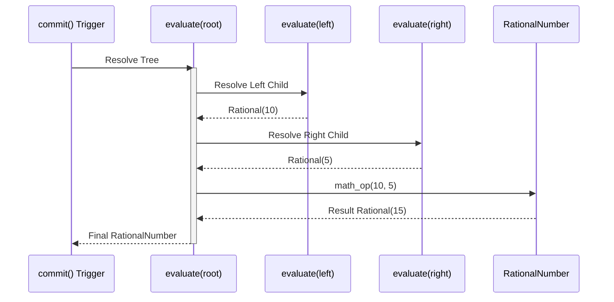

# 04 - Motor de Execução e Arredondamento



## Objetivo
Processar a Árvore AST em um resultado numérico final (`RationalNumber`), garantindo conformidade com regras contábeis e matemáticas rigorosas no motor CalcAUY.

## O Conceito de "Commit"
Diferente da versão anterior, a nova CalcAUY não executa o cálculo matemático a cada chamada de método (`add`, `mult`, etc.). Cada chamada apenas anexa um novo nó à AST.
- **Vantagem:** Permite a serialização do cálculo em qualquer estágio sem perda de precisão e a aplicação correta da ordem das operações no final.
- **Implementação:** O método `commit()` em `src/builder.ts:827-849` invoca `evaluate()` para colapsar a AST, gera a assinatura digital via `generateSignature()`, e retorna um `CalcAUYOutput` já selado.

## Arredondamentos Críticos
Para cálculos fiscais e contábeis, a lib deve implementar:
1. **Divisão Inteira Euclidiana:** Onde o resto (`mod`) é sempre positivo, seguindo o Teorema da Divisão de Euclides. Implementado em `src/core/rational.ts` via operações com BigInt.
2. **Arredondamentos Fiscais (NBR-5891):** Implementar estratégias como `half-even` (arredondamento bancário) e `half-up` (comercial) apenas no momento da **saída** (output), mantendo as 50 casas decimais do `RationalNumber` durante todo o processo interno. O arredondamento **não** ocorre no `commit()` — ele é aplicado sob demanda via `applyRounding()` (`src/core/rounding.ts:178-185`) nos métodos de output:
    ```ts
    export function applyRounding(
        val: RationalNumber,
        roundStrategy: RoundingStrategy,
        precision: number,
    ): RationalNumber {
        const handler = RoundingHandlers[roundStrategy];
        return handler(val, precision);
    }
    ```
3. **Estratégias disponíveis** (`src/core/constants.ts:19-26`): `NBR5891`, `HALF_UP`, `HALF_EVEN`, `TRUNCATE`, `CEIL`, `NONE`. Cada estratégia possui seu handler em `RoundingHandlers` (`src/core/rounding.ts:39-173`).
4. **Cache de Precisão:** `CalcAUYOutput` mantém um cache interno `#cache: Map<number, RationalNumber>` (`src/output.ts:57`) para evitar recalcular o arredondamento para a mesma precisão.

## Algoritmo de Colapso (Evaluation)

### Função `evaluate()`
Definida em `src/ast/engine.ts:30-47`. Aceita um nó `CalculationNode` e profundidade inicial, delegando para o motor iterativo `iterativeEvaluate()` (`src/ast/engine.ts:59-144`). Em modo debug, envolve a execução com `measureTime()` para telemetria de performance.

### Motor Iterativo Stack-based
Diferente de implementações recursivas, esta abordagem elimina o risco de `Stack Overflow` mesmo em árvores extremamente profundas ou com alta densidade de metadados (que impedem o aplanamento estrutural).

### Funcionamento Interno:
1.  **Pilha de Trabalho (`workStack`):** Array de `EvalTask` — tarefas do tipo `"eval"` (resolver nó) ou `"apply"` (aplicar operação). (`src/ast/engine.ts:52-54`)
    ```ts
    type EvalTask =
        | { type: "eval"; node: CalculationNode; depth: number }
        | { type: "apply"; op: OperationType; count: number; parent: CalculationNode; depth: number };
    ```
2.  **Post-order Traversal Iterativo:** A árvore é percorrida em duas fases: primeiro agenda-se a tarefa `"apply"` (que consumirá os resultados da pilha), depois as tarefas `"eval"` para cada operando em ordem reversa (para que o primeiro operando seja o primeiro a ser processado).
3.  **Pilha de Resultados (`resultStack`):** `RationalNumber[]` — operandos resolvidos são acumulados aqui; a tarefa `"apply"` os remove (`pop()`) e empilha o resultado da operação.
4.  **Segurança de Profundidade:** A cada tarefa `"eval"`, a profundidade é incrementada e comparada com `MAX_RECURSION_DEPTH = 500` (`src/core/constants.ts:48`). Se excedido, dispara erro `"math-overflow"` (`src/ast/engine.ts:67-73`).
5.  **Hierarchical Flattening:** Quando o número de operandos de uma operação atinge `MAX_OPERANDS = 100` (`src/core/constants.ts:60`), o builder quebra automaticamente a operação em sub-árvores binárias, mantendo a profundidade em O(log N). Implementado em `src/ast/builder_utils.ts`.

### Otimização de Performance e Telemetria
Durante o colapso, o motor deve confiar na simplificação automática (MDC) do `RationalNumber`. Adicionalmente, as seguintes otimizações são aplicadas:
1. **Telemetry Spans:** O motor utiliza `TelemetrySpan` (Explicit Resource Management) para medir a duração exata do colapso em modo debug, permitindo auditoria de performance granular.
2. **Instance-Level Caching:** O resultado do colapso e as strings de rastro (LaTeX, Unicode, Mermaid) são cacheados na instância do `CalcAUYOutput` após a primeira chamada.
3. **Percurso Único:** Operações complexas como o `commit()` injetam assinaturas digitais BLAKE3 baseadas no estado final da árvore e do resultado, garantindo integridade forense.

## Segurança em Runtime
- **Teto de Bits (`MAX_BI_BITS`):** Definido em `src/core/constants.ts:39` como `1_000_000` (1M bits). O `RationalNumber` verifica se `n` ou `d` ultrapassam `MAX_BI_LIMIT = 1n << MAX_BI_BITS` (`src/core/constants.ts:40`) antes de cada operação, lançando erro `"math-overflow"` se o limite for excedido.
- **Prevenção de Stack Overflow:** O motor iterativo (stack-based) em `src/ast/engine.ts` elimina a recursão profunda na pilha de chamadas V8. A profundidade lógica é monitorada contra `MAX_RECURSION_DEPTH = 500` (`src/core/constants.ts:48`).
- **Limites de Reidratação:** Durante `hydrate()`, a profundidade máxima da AST é limitada por `MAX_HYDRATE_DEPTH = 500` e o número total de nós por `MAX_HYDRATE_NODES = 1000` (`src/core/constants.ts:51-52`).
- **Precisão Interna:** O `RationalNumber` mantém precisão arbitrária durante todo o processamento. `PRECISION_BIGINT = 50n` (`src/core/constants.ts:12`) define a escala para operações de potência que geram dízimas, truncando para 50 casas decimais sem perda de integridade racional.

---

[↑ Voltar ao índice](../index.md)
