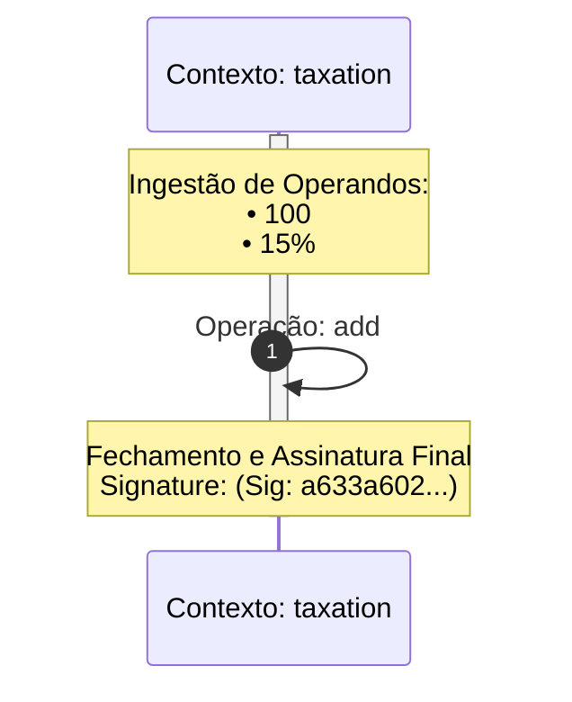
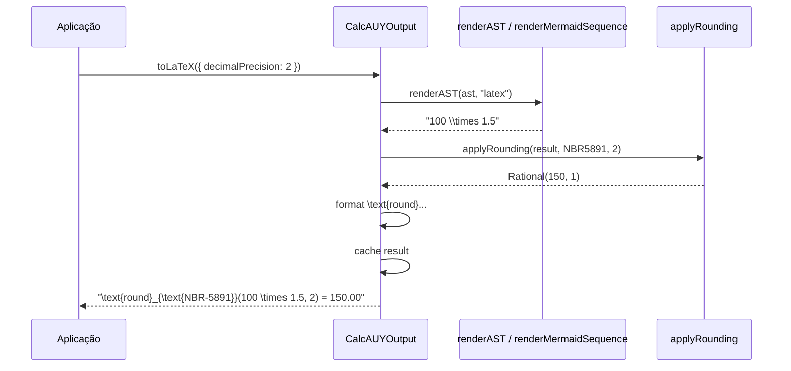

# 05 — Processadores de Saída e Auditoria Visual

```mermaid
flowchart LR
    Commit[commit()] --> Output[CalcAUYOutput]
    Output --> toString[toStringNumber]
    Output --> toL[toLaTeX]
    Output --> toU[toUnicode]
    Output --> toV[toVerbalA11y]
    Output --> toM[toMermaidGraph]
    Output --> toCustom[toCustomOutput]
    toCustom --> HTML[htmlProcessor]
    toCustom --> IMG[imageBufferProcessor]
    toCustom --> PB[protobufProcessor]
```

## Arquitetura Centralizada

`CalcAUYOutput` (implementado em `src/output.ts`) é o contêiner imutável retornado por `commit()`. Ele centraliza **todas** as transformações de saída, evitando dispersão de lógica de formatação pelo código.

### Lazy Evaluation com Cache

Cada método de saída mantém sua própria entrada em `#outputCache: Map<string, string | Uint8Array>`. A primeira chamada popula o cache; chamadas subsequentes retornam o valor armazenado — sem recálculo.

```typescript
// src/output.ts:58
readonly #outputCache: Map<string, string | Uint8Array> = new Map();
```

As chaves do cache seguem o padrão `"nomeDoMetodo:parametros"`:

| Método | Chave de cache |
|--------|---------------|
| `toStringNumber` | `"toStringNumber:{precision}:{isNone}"` |
| `toLaTeX` | `"toLaTeX:{precision}:{isNone}"` |
| `toUnicode` | `"toUnicode:{precision}:{isNone}"` |
| `toMermaidGraph` | `"toMermaidGraph:{locale}"` |
| `toMonetary` | `"toMonetary:{locale}:{currency}:{precision}:{isNone}"` |
| `toAuditTrace` | `"auditTrace"` (fixa) |

### Padrão `*Internal`

Cada método público possui um correspondente privado `*Internal` que contém a lógica real. Os métodos públicos adicionam apenas o `TelemetrySpan` e delegam ao `*Internal`. Isso permite que `toJSON()` e `toCustomOutput()` chamem os métodos internos sem gerar spans duplicados e sem poluir o cache de telemetria.

```typescript
// src/output.ts:116-134
public toStringNumber(options?: OutputOptions): string {
    using _span = startSpan("toStringNumber", logger, options);
    return this.toStringNumberInternal(options);
}

private toStringNumberInternal(options?: OutputOptions): string {
    const p = this.getEffectivePrecision(options);
    const isNone = this.#roundStrategy === "NONE";
    const cacheKey = `toStringNumber:${p}:${isNone}`;
    if (this.#outputCache.has(cacheKey)) return this.#outputCache.get(cacheKey) as string;
    const result = isNone ? this.#result.toDecimalString(p) : this.getRounded(p).toDecimalString(p);
    const finalResult = isNone ? result.replace(/\.?0+$/, "").replace(/\.$/, "") || "0" : result;
    this.#outputCache.set(cacheKey, finalResult);
    return finalResult;
}
```

## Métodos de Formatação Visual

### `toLaTeX(options?)`

Delega a renderização da AST a `renderAST(this.#ast, "latex")` (`src/output_internal/renderer.ts`). O resultado é embrulhado em `\text{round}_{\text{ESTRATÉGIA}}(expressão, precisão) = valor`.

```typescript
// src/output.ts:312-326
private toLaTeXInternal(options?: OutputOptions): string {
    const p = this.getEffectivePrecision(options);
    const isNone = this.#roundStrategy === "NONE";
    const cacheKey = `toLaTeX:${p}:${isNone}`;
    if (this.#outputCache.has(cacheKey)) return this.#outputCache.get(cacheKey) as string;

    const base = renderAST(this.#ast, "latex");
    let roundedStr = this.toStringNumberInternal(options);
    roundedStr = roundedStr.replace(/%/g, String.raw`\%`);
    const strategyName = ROUNDING_IDS[this.#roundStrategy];
    const result = String.raw`\text{round}_{\text{${strategyName}}}(${base}, ${p}) = ${roundedStr}`;
    this.#outputCache.set(cacheKey, result);
    return result;
}
```

**Renderização de operações no formato LaTeX** (`src/output_internal/renderer.ts`):

| Operação | Saída LaTeX |
|----------|-------------|
| `add` | `+` |
| `sub` | `-` |
| `mul` | `\times` |
| `div` | `\frac{a}{b}` |
| `pow` | `base^{exp}` (ou `\sqrt[n]{base}` se expoente fracionário) |
| `mod` | `\bmod` |
| `group` | `\left( ... \right)` |
| Literal com `/` | `\frac{n}{d}` |

### `toVerbalA11y(options?, customLocale?)`

Gera uma frase narrativa do cálculo completo para acessibilidade (leitores de tela). Usa `renderAST(this.#ast, "verbal", loc)` com operadores traduzidos por locale.

```typescript
// src/output.ts:445-453
private toVerbalA11yInternal(options?: OutputOptions, customLocale?: CalcAUYLocaleA11y): string {
    const p = this.getEffectivePrecision(options);
    const loc = customLocale || getLocale(options?.locale);
    const base = renderAST(this.#ast, "verbal", loc);
    const strategyName = ROUNDING_IDS[this.#roundStrategy];
    const finalValueStr = this.toStringNumberInternal(options).replace(".", loc.voicedSeparator);
    const { phrases } = loc;
    return `${base}${phrases.isEqual}${finalValueStr} (${phrases.rounding}: ${strategyName} ${phrases.for} ${p} ${phrases.decimalPlaces}).`;
}
```

**Exemplo com locale `pt-BR`:**

```
12.5 multiplicado por 0.15 é igual a 1 vírgula 88 (Arredondamento: HALF_UP para 2 casas decimais).
```

**Locale `ja-JP`:**

```
12.5 かける 0.15 は 1 点 88 (丸め: HALF_UP で 2 桁).
```

### `toUnicode(options?)`

Usa `renderAST(this.#ast, "unicode")` e converte o nome da estratégia para subscrito Unicode via `toSubscript()` (`src/output_internal/unicode.ts`).

```typescript
// src/output_internal/unicode.ts:31-66
const SUBSCRIPTS: Record<string, string> = {
    "0": "₀", "1": "₁", "2": "₂", "3": "₃",
    "4": "₄", "5": "₅", "6": "₆", "7": "₇",
    "8": "₈", "9": "₉", "-": "₋",
};
```

**Saída exemplo:**
```
roundₙᵦᵣ₋₅₈₉₁(5000 × 1.5 + 1200, 2) = 8700.00
```

### `toHTML()` e `toImageBuffer()` — Não são métodos nativos

Diferentemente dos métodos acima, `toHTML()` e `toImageBuffer()` **não** são métodos diretos de `CalcAUYOutput`. Eles são acessados via `toCustomOutput(processor)`:

```typescript
import { htmlProcessor } from "@st-all-one/calc-auy/html";
import { imageBufferProcessor } from "@st-all-one/calc-auy/image-buffer";

const output = calc.from(100).add(50).commit();
const html = output.toCustomOutput(htmlProcessor);
const png = output.toCustomOutput(imageBufferProcessor);
```

A interface do processador customizado (`src/output_internal/types.ts`):

```typescript
export type CalcAUYCustomOutput<Toutput, Toptions extends OutputOptions = OutputOptions> = (
    this: CalcAUYOutput,
    context: CalcAUYCustomOutputContext<Toptions>,
) => Toutput;

export type CalcAUYCustomOutputContext<Toptions extends OutputOptions = OutputOptions> = {
    result: RationalNumber;
    ast: CalculationNode;
    roundStrategy: RoundingStrategy;
    audit: { latex: string; unicode: string; verbal: string };
    options: Readonly<Toptions>;
    methods: Pick<CalcAUYOutput, /* todos os métodos públicos */>;
};
```

### `toMermaidGraph(options?)`

Gera um diagrama de sequência Mermaid.js representando todo o fluxo do cálculo: ingestão de operandos, operações, handovers entre contextos, e assinatura final.

Delega a `renderMermaidSequence()` em `src/output_internal/mermaid_sequence_renderer.ts`:

```typescript
// src/output.ts:391-400
private toMermaidGraphInternal(options?: OutputOptions): string {
    const loc = getLocale(options?.locale);
    const cacheKey = `toMermaidGraph:${loc.locale}`;
    let graph = this.#outputCache.get(cacheKey) as string;
    if (graph === undefined) {
        graph = renderMermaidSequence(this.#ast, this.#config, this.#signature, loc);
        this.#outputCache.set(cacheKey, graph);
    }
    return graph;
}
```

#### Funcionamento Interno do Renderizador Mermaid

O `renderMermaidSequence()` (`src/output_internal/mermaid_sequence_renderer.ts:25-249`) percorre a AST recursivamente e constrói uma lista cronológica de eventos (`MermaidSequenceEvent`):

| Tipo de Evento | Descrição |
|---------------|-----------|
| `note` | Nota sobre contexto (ingestão, fechamento, metadados) |
| `transition` | Handover entre contextos (`fromContext ->>+ context`) |
| `action` | Self-call da operação matemática |

**Regras de renderização:**
- **Agrupamento de literais**: operandos consecutivos são agrupados em uma única nota `"Ingestão de Operandos"` com lista de valores.
- **Handover**: nós do tipo `control` disparam transição entre contextos, preservando a assinatura do contexto anterior.
- **I18n**: todos os labels vêm do locale (`loc.mermaid`).
- **PII**: se `sensitive !== false` ou metadado `pii: true`, o valor do operando é substituído por `[REDACTED]`.

```typescript
// src/output_internal/mermaid_sequence_renderer.ts:189-192
if (node.kind === "literal") {
    const input = isPII ? "[REDACTED]" : node.originalInput;
    literalBuffer.push({ input, timestamp, userMeta });
}
```

**Exemplo de saída:**


## Arredondamento Tardio (Late Rounding)

Todos os métodos de saída aplicam o arredondamento **apenas no momento da formatação**, nunca no `RationalNumber` interno. Isso é feito via `getRounded(precision)`:

```typescript
// src/output.ts:77-84
private getRounded(precision: number): RationalNumber {
    if (!this.#cache.has(precision)) {
        const rounded = applyRounding(this.#result, this.#roundStrategy, precision);
        this.#cache.set(precision, rounded);
    }
    return this.#cache.get(precision)!;
}
```

`applyRounding()` (`src/core/rounding.ts:178-185`) seleciona o handler da `RoundingHandlers` com base na estratégia configurada em `create({ roundStrategy })`. A precisão é definida por saída via `options.decimalPrecision`.

### Estratégias de Arredondamento

| Estratégia | Handler | Comportamento |
|-----------|---------|---------------|
| `NBR5891` | ABNT NBR 5891:1977 | Regra do par para 0.5 exato |
| `HALF_UP` | Comercial | ≥ 0.5 arredonda para cima |
| `HALF_EVEN` | Bancário | Para o número par mais próximo |
| `TRUNCATE` | Corte seco | Descarta decimais excedentes |
| `CEIL` | Teto | Sempre arredonda para cima |
| `NONE` | Nenhum | Mantém o racional puro (precisão 50) |

## Linha do Tempo de um Output



## Referências

- Classe central: `src/output.ts`
- Renderizador de AST multiformato: `src/output_internal/renderer.ts`
- Renderizador Mermaid: `src/output_internal/mermaid_sequence_renderer.ts`
- Tabela de subscritos Unicode: `src/output_internal/unicode.ts`
- Internacionalização e locales: `src/output_internal/i18n.ts`
- Tipos de processador customizado: `src/output_internal/types.ts`
- Algoritmos de arredondamento: `src/core/rounding.ts`
- Constantes de arredondamento: `src/core/constants.ts`

---

[↑ Voltar ao índice](../index.md)
