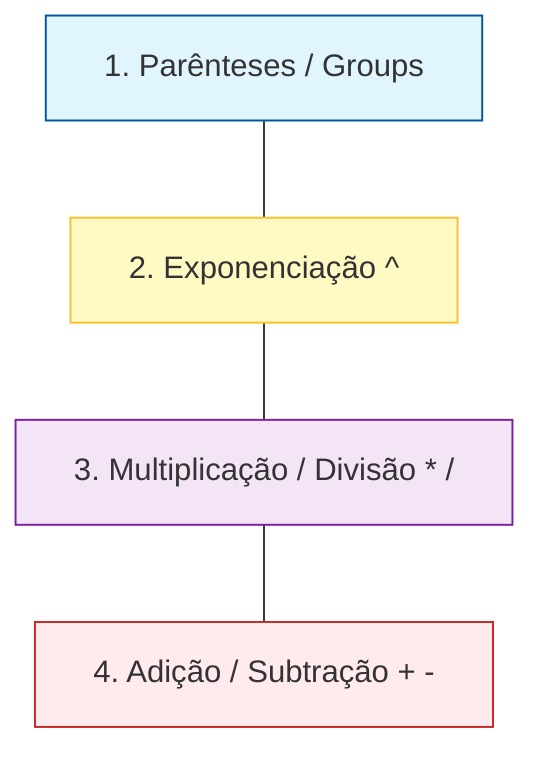

# 07 - Tabela de Precedência e Associatividade Rigorosa



## Objetivo
Estabelecer a "Lei de Execução" do motor CalcAUY, garantindo que qualquer expressão, seja via Parser ou via encadeamento de métodos, resulte em uma Árvore AST matematicamente correta e previsível.

## Tabela de Hierarquia (Maior para Menor)

| Nível | Operação | Símbolo | Associatividade | Descrição |
| :--- | :--- | :--- | :--- | :--- |
| 1 | **Agrupamento** | `( ... )` ou `.group()` | N/A | Força a avaliação prioritária do conteúdo interno. |
| 2 | **Exponenciação** | `^` ou `**` | **Direita** | `a^b^c` é avaliado como `a^(b^c)`. |
| 3 | **Multiplicativos** | `*`, `/`, `//`, `%` | **Esquerda** | Multiplicação, Divisão, Divisão Inteira e Módulo. |
| 4 | **Aditivos** | `+`, `-` | **Esquerda** | Soma e Subtração. |

## Regras Detalhadas e Casos Extremos

### 1. Associatividade à Direita (Torre de Potências)
Diferente da aritmética linear, a torre de potências deve ser resolvida do topo para a base.
- **Caso Extremo:** `2^3^4^2`
- **Análise AST:** O cálculo deve ser `2^(3^(4^2)) = 2^(3^16) = 2^43046721`.
- **Implementação:** O Parser deve ser recursivo à direita para garantir que o nó de potência mais à direita na string seja o mais profundo na árvore.

### 2. Multiplicação e Operações dentro de Expoentes
O Parser deve tratar o conteúdo do expoente como uma sub-expressão completa apenas se houver agrupamento explícito. Sem parênteses, a exponenciação "rouba" apenas o operando imediato.
- **Caso Extremo:** `2^3*4` vs `2^(3*4)`
- **`2^3*4`:** Avaliado como `(2^3) * 4 = 8 * 4 = 32`. A potência tem precedência superior, então ela é resolvida antes da multiplicação.
- **`2^(3*4)`:** Avaliado como `2^12 = 4096`. O grupo força a multiplicação a ocorrer antes da base ser elevada.

### 3. O Método Especial `.group()` (Fluent API)
No encadeamento de métodos, o `.group()` atua como um "colapsador léxico" da AST construída até aquele momento, isolando as operações anteriores.
- **Comportamento:** Ele envolve toda a AST acumulada em um `GroupNode`.
- **Exemplo:** `CalcAUY.create({ contextLabel: "ex", salt: "fixo" }).from(10).add(5).group().mult(2)`
- **Resultado:** Produz `(10 + 5) * 2 = 30`. Sem o `.group()`, a chamada `.mult(2)` resultaria em `10 + (5 * 2) = 20` devido à precedência natural da multiplicação.
- **Código real:** Em `src/builder.ts:667`, o método `group()` cria um `GroupNode` com `kind: "group"` encapsulando a AST atual. Se o nó já for `group` ou `literal`, retorna `this` (idempotente):

```ts
public group(): CalcAUYLogic<Context, Config> {
    const ast = this.assertAST();
    if (ast.kind === "group" || ast.kind === "literal") {
        return this;
    }
    const node: GroupNode = { kind: "group", child: ast };
    // ...
    return new CalcAUYLogic<Context, Config>(node, this.#instanceId, this.#config, this.#birthTime);
}
```

- **Código real — `attachOp`:** Em `src/ast/builder_utils.ts`, a função `attachOp(ast, type, rightNode)` é o motor central que aplica a precedência. O operando direito NUNCA é simplesmente anexado — ele é inserido respeitando a hierarquia dos operadores. Se o nó atual for uma operação de menor precedência, o novo operador assume a raiz.

### 4. Operações Multiplicativas (Mesmo Nível)
Divisão (`/`), Divisão Inteira (`//`) e Módulo (`%`) compartilham o mesmo nível de precedência da multiplicação.
- **Regra:** Em caso de empate (sequência de operações do mesmo nível), resolve-se da **esquerda para a direita**.
- **Exemplo:** `100 / 10 % 3 * 2` -> `((100 / 10) % 3) * 2 = (10 % 3) * 2 = 1 * 2 = 2`.

### 5. Divisão Inteira (`//`) vs Divisão Comum (`/`)
Ambas possuem a mesma precedência. A diferença reside apenas no algoritmo de colapso:
- `/`: Retorna um `RationalNumber` pleno (fração simplificada).
- `//`: Retorna um `RationalNumber` onde o resultado é o piso (`floor`) da divisão, conforme regra euclidiana.

### 6. Tratamento de Sinais Unários
Sinais unários (ex: `-5` ou `+10`) possuem precedência superior à exponenciação no Parser para literais.
- **Exemplo:** `-2^2` deve ser tratado como `(-2)^2 = 4` se o sinal estiver colado ao literal.
- **Decisão CalcAUY:** Para evitar ambiguidades financeiras, sinais unários devem sempre vincular-se ao literal imediatamente à direita. Se a intenção for `-(2^2)`, o uso de parênteses é obrigatório.

### 7. Otimização: Hierarchical Flattening (Aplanamento Associativo)
Em operações lineares massivas do mesmo tipo (ex: somar 1.000 itens consecutivamente), a construção padrão da AST geraria uma árvore de profundidade O(N), resultando em `Stack Overflow` no colapso.
- **Regra de Otimização:** O método `attachOp` monitora a largura do nó de operação. Ao atingir o limite de **100 operandos** (`MAX_OPERANDS`), o motor cria automaticamente uma nova camada na árvore.
- **Constante real:** `MAX_OPERANDS = 100` em `src/core/constants.ts:60`:
```ts
export const MAX_OPERANDS = 100;
```
- **Mecanismo:** Quando `operands.length >= MAX_OPERANDS`, o `attachOp` reorganiza os operandos existentes em uma sub-árvore balanceada, reduzindo a profundidade de O(N) para **O(log N)**, mantendo o custo de construção linear e a execução segura em qualquer escala. Esta otimização é ignorada para a operação `pow` devido à sua natureza de associatividade à direita.

## Representação na AST
A estrutura da árvore **DEVE** refletir visualmente a precedência através da profundidade dos nós.
- Operações de **menor precedência** (Soma) ficam mais próximas da **raiz**.
- Operações de **maior precedência** (Potência ou Grupos) ficam nas **folhas** ou sub-níveis profundos.

### Exemplo de AST para `(10 + 5) * 2^3`:
```text
Root: OperationNode(*)
 ├── Left: GroupNode
 │    └── child: OperationNode(+)
 │         ├── Left: LiteralNode(10)
 │         └── Right: LiteralNode(5)
 └── Right: OperationNode(^)
      ├── Left: LiteralNode(2)
      └── Right: LiteralNode(3)
```

## Validação de Redundância e Inconsistência
- **Redundância:** Se o usuário fornecer `(2^3)`, o Parser identifica que os parênteses são redundantes e pode optar por mantê-los ou simplificá-los conforme a estratégia de auditoria. No motor CalcAUY, a estrutura é preservada para garantir fidelidade ao input original.
- **Inconsistência:** O Parser deve disparar `CalcAUYError` imediato para expressões como `10 ^ * 5` ou `(10 + 5))`. As regras de lint do projeto, configuradas em `deno.jsonc:73-102`, incluem `no-eval`, `no-throw-literal`, `eqeqeq` (igualdade estrita), `explicit-function-return-type`, `explicit-module-boundary-types` e `verbatim-module-syntax` para garantir que a implementação seja rigorosa e sem ambiguidades.

### Tipos de Nó na AST
A hierarquia de precedência é refletida nos tipos definidos em `src/ast/types.ts`:

```ts
export type NodeKind = "literal" | "operation" | "group" | "control";

export type OperationType =
    | "add" | "sub" | "mul" | "div" | "pow" | "mod" | "divInt" | "crossContextAdd";
```

O `group` (kind `"group"`) corresponde ao Nível 1 da tabela. O `operation` com `type: "pow"` (Nível 2) tem associatividade à direita. Mul/div/mod/divInt (Nível 3) e add/sub (Nível 4) têm associatividade à esquerda, implementada pela lógica de `attachOp` que insere novos operandos na posição correta da árvore.

---

[↑ Voltar ao índice](../index.md)
