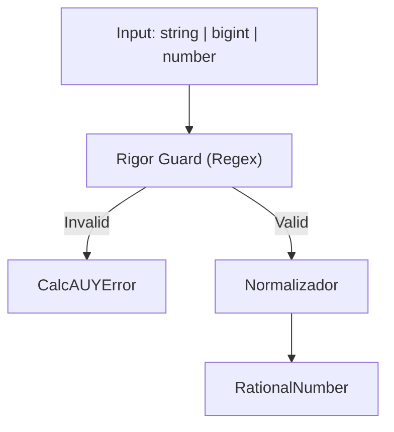

# 08 - Especificação Restritiva de Input e Lexer



## Objetivo
Atuar como o "Guardião da Integridade" da CalcAUY 2.0, garantindo que apenas dados numericamente puros e inequívocos entrem no sistema, convertendo-os diretamente para a forma racional sem perda de precisão por escala fixa.

## 1. Tipos de Entrada Permitidos (Rigor Superior)

Diferente da versão 1.0, o input **DEVE** ser preferencialmente `string` ou `bigint`. O tipo `number` (IEEE 754) é desencorajado e deve ser validado para garantir que não contenha imprecisões de ponto flutuante antes de ser aceito.

### Tipos Aceitos na API Pública

A união de tipos permitidos é definida em `src/core/rational.ts:84` como `RationalInput`:

```ts
export type RationalInput = string | number | bigint | RationalNumber;
```

E na fluent API (`src/builder.ts:57`) como `InputValue`:

```ts
export type InputValue<C extends string, P extends InstanceConfig = InstanceConfig> =
    | string
    | number
    | bigint
    | CalcAUYLogic<C, P>;
```

**Total de 5 tipos concretos aceitos:**
1. `string` — expressões numéricas (decimal, fração, percentual, notação científica)
2. `number` — IEEE 754 (desencorajado, validado com `Number.isFinite`)
3. `bigint` — inteiros de precisão arbitrária
4. `RationalNumber` — instância racional já construída
5. `CalcAUYLogic` — outro builder (mesmo contexto) para composição

### Tipos Rejeitados

A biblioteca **rejeita explicitamente** os seguintes valores com `CalcAUYError("unsupported-type", ...)` em `src/core/rational.ts:191-202`:

| Valor | Motivo |
| :--- | :--- |
| `null` | Ausência de valor |
| `undefined` | Indefinido |
| `NaN` | Não-numérico |
| `Infinity` / `-Infinity` | Não-finito |
| Objetos literais `{}` | Sem representação numérica unívoca |
| Arrays `[]` | Coleção, não escalar |
| Funções | Comportamento não determinístico |
| Symbols | Sem valor matemático |

### Formatos Suportados
- **Inteiros:** `100`, `-50`, `1_000_000`.
- **Decimais:** `10.50`, `-0.0001`, `.5`. (Convertidos para `n/10^x`). Entradas que começam com ponto (ex: `.5`) são normalizadas visualmente para `0.5` nos outputs.
- **Frações:** `1/3`, `-22/7`. (Mantidos como racionais puros).
- **Percentuais:** `10%`, `1.5%`, `1_000.5%`. (Convertidos para `n/100`).
- **Científicos:** `1.5e-10`, `6.022e23`.
- **Literais BigInt:** `100n`.

### Expressões Regulares de Validação (Rigor Guard)

Em `src/core/rational.ts:41-43`, três regexes atuam como guardiões do parser:

```ts
const BIGINT_RE = /^[+-]?\d+(?:_\d+)*n?$/;
const FRACTION_RE = /^[+-]?\d+(?:_\d+)*\/[+-]?\d+(?:_\d+)*$/;
const DECIMAL_RE = /^[+-]?(?:\d+(?:_\d+)*(?:\.\d+(?:_\d+)*)?|\.\d+(?:_\d+)*)(?:[eE][+-]?\d+(?:_\d+)*)?$/;
```

- `BIGINT_RE`: Inteiros com suporte a `_` como separador visual e sufixo `n`.
- `FRACTION_RE`: Frações no formato `numerador/denominador`, ambos com suporte a `_`.
- `DECIMAL_RE`: Decimais com ponto, notação científica (`e`/`E`), e suporte a `.5` (ponto inicial).

**Fluxo de validação em** `RationalNumber.fromString()` (`src/core/rational.ts:205-282`):

```ts
const trimmed = input.trim();
const isBigInt = BIGINT_RE.test(trimmed);
const isFraction = FRACTION_RE.test(trimmed);
const isPercent = trimmed.endsWith("%");
const valToTest = isPercent ? trimmed.slice(0, -1) : trimmed;
const isDecimal = DECIMAL_RE.test(valToTest);

if (!isBigInt && !isFraction && !isDecimal) {
    throw new CalcAUYError("invalid-syntax", `String numérica inválida: "${input}"`);
}
```

### Percentuais: Lógica de Conversão

Strings que terminam com `%` sofrem tratamento especial. O `%` é removido, o valor base é parseado conforme seu formato (decimal, fração, bigint), e então dividido por 100:

```ts
// src/builder.ts:158-163
if (trimmed.endsWith("%")) {
    inputStr = `${trimmed.slice(0, -1).replace(/_/g, "")}/100`;
}
```

E no `RationalNumber.fromString()` (`src/core/rational.ts:273-275`):

```ts
if (isPercent) {
    result = result.div(RationalNumber.from(100n));
}
```

**Exemplos de conversão percentual:**

| Entrada | Parse Intermediário | Resultado Racional |
| :--- | :--- | :--- |
| `"10%"` | `"10/100"` | `1/10` |
| `"1.5%"` | `"1.5" → 15/10 → /100` | `3/200` |
| `"1_000.5%"` | `"1_000.5" → 10005/10 → /100` | `2001/20` |

## 2. Regras de Restrição e Segurança (Runtime)

O Parser deve disparar `CalcAUYError` e interromper o fluxo se detectar:
1. **Valores Não-Finitos:** `NaN`, `Infinity`, `-Infinity`.
2. **Ambiguidade de Separador:** Uso misto de `.` e `,` na mesma string sem definição clara de locale.
3. **Lixo de String:** `10.50abc`, `10..5`, `1/2/3`.
4. **Underscores Inválidos:** `_100`, `100_`, `10__0`. (Devem seguir a regra de separador interno).
5. **Tipos Proibidos:** `null`, `undefined`, `object` (exceto instâncias da própria lib ou AST).

## 3. Lógica de Conversão para `RationalNumber`

Ao contrário da versão anterior que escalava tudo para $10^{12}$, a nova versão deve manter a natureza do número:

| Entrada | Lógica de Conversão | Resultado Racional (`n/d`) |
| :--- | :--- | :--- |
| `"0.25"` | 2 casas decimais -> $25/100$ | $1/4$ |
| `"10.5%"` | $(105/10) / 100$ | $21/200$ |
| `"1/3"` | Mantém numerador e denominador | $1/3$ |
| `"1e-2"` | Expoente negativo -> $1/10^2$ | $1/100$ |
| `100n` | Denominador padrão 1 | $100/1$ |

### Algoritmo de Simplificação (GCD)

Toda conversão passa pelo GCD híbrido (`src/core/rational.ts:53-79`) que simplifica a fração à forma irredutível:

```ts
private constructor(n: bigint, d: bigint) {
    if (d === 0n) {
        throw new CalcAUYError("division-by-zero", "O denominador não pode ser zero.");
    }
    // Normalização do sinal
    if (den < 0n) { num = -num; den = -den; }
    // Simplificação
    const common: bigint = gcd(num, den);
    this.#n = num / common;
    this.#d = den / common;
}
```

### Safety Check (Overflow)

Antes de cada operação, `checkSafety()` (`src/core/rational.ts:136-147`) valida o limite de 1 milhão de bits (`MAX_BI_BITS = 1_000_000n` em `src/core/constants.ts:39`):

```ts
if (absN > MAX_BI_LIMIT || absD > MAX_BI_LIMIT) {
    throw new CalcAUYError("math-overflow",
        `O resultado da operação excede o limite de segurança de ${MAX_BI_BITS} bits.`);
}
```

## 4. Normalização e Higienização

Antes de processar, a lib realiza:
- Remoção de underscores (`_`) para cálculo, mantendo-os no `originalInput` se solicitado (exceto em percentuais normalizados).
- Normalização de ponto inicial: `.5` é tratado matematicamente como `0.5`.
- Validação de sinal único no início.
- **Remoção de underscores:** `valToTest.replaceAll("_", "")` em `src/core/rational.ts:232`.

## 5. Lexer e Tokenização

O processo de tokenização para a AST é atômico e suporta:
- **NUMBER:** Sequência de dígitos, ponto, notação científica ou sufixo `n`.
- **OPERATOR:** `+`, `-`, `*`, `/`, `//` (Divisão Inteira), `%` (Módulo ou Percentual), `^`.
- **PARENTHESES:** `(` e `)`.

### Exemplo de Fluxo de Rigor:
Input: `"1_000.50 / (1/3)"`
1. **Clean:** `"1000.50/(1/3)"`
2. **Tokens:** `[NUM(1000.50), OP_DIV, LPAREN, NUM(1/3), RPAREN]`
3. **Rational Conversion:** `NUM(1000.50)` vira `100050/100` -> `2001/2`.
4. **Result:** A AST processará a divisão entre `2001/2` e `1/3`.

### Sistema de Cache de Literais

Para evitar recriação de `LiteralNode` e `RationalNumber`, ambos os níveis usam um sistema de cache em dois níveis:

```ts
// Hot Cache - src/builder.ts:46
const hotLiteralNodeCache = new Map<string, LiteralNode>();
const HOT_CACHE_LIMIT = 512;

// Cold Cache - src/builder.ts:55
const globalLiteralNodeCache = new Map<string, WeakRef<LiteralNode>>();
```

O mesmo padrão se aplica a `RationalNumber` em `src/core/rational.ts:29-38`.

## 6. Diferencial de Auditoria (Original Input)
Cada `LiteralNode` na AST **DEVE** preservar a string original de entrada (`originalInput`). Isso permite que, no rastro de auditoria, possamos mostrar exatamente o que o usuário digitou (ex: `"1/3"`) em vez do valor processado (ex: `0.333...`).

```ts
// src/builder.ts:761-768
#createBaseNode(input: string): LiteralNode {
    const r: RationalNumber = RationalNumber.from(input);
    return {
        kind: "literal",
        value: r.toJSON() as RationalValue,
        originalInput: input,  // ← preservado para auditoria
    };
}
```

---

[↑ Voltar ao índice](../index.md)
