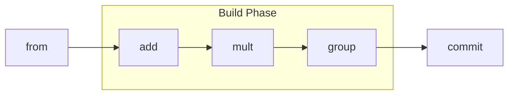

# 10 - API Fluida de Construção de Cálculo (CalcAUYLogic)



## Objetivo
Definir a interface de construção de expressões matemáticas. A `CalcAUY` utiliza o padrão **Fluent Builder**, onde cada operação anexa um nó à Árvore AST em uma jurisdição isolada (instância).

## Comportamento de Auto-Agrupamento (Critical Feature)
Diferente das APIs tradicionais, a injeção de uma instância de `CalcAUYLogic` em outra resulta em um agrupamento léxico automático.
- **Regra:** `A.op(B)` onde `B` é `CalcAUYLogic` -> `A op (B)`.
- **Exemplo:** `instance.from(10).mult(instance.from(2).add(3))` -> `10 * (2 + 3) = 50`. Sem o auto-agrupamento, a precedência da multiplicação poderia corromper a intenção, resultando em `(10 * 2) + 3 = 23`.

## Métodos de Operação Matemática

### `add(value: InputValue): CalcAUYLogic`
- **Operação:** Soma aritmética.
- **AST:** `OperationNode(+)`.
- **Exemplo:** `.add("1.50")` ou `.add(instance.from(10))`.

### `sub(value: InputValue): CalcAUYLogic`
- **Operação:** Subtração aritmética.
- **AST:** `OperationNode(-)`.

### `mult(value: InputValue): CalcAUYLogic`
- **Operação:** Multiplicação.
- **AST:** `OperationNode(*)`. Respeita a precedência matemática PEMDAS.

### `div(value: InputValue): CalcAUYLogic`
- **Operação:** Divisão racional (Fração).
- **AST:** `OperationNode(/)`. Mantém a precisão infinita via `RationalNumber`.

### `pow(exponent: InputValue): CalcAUYLogic`
- **Operação:** Potência e Raiz (se expoente < 1 ou fracionário).
- **Associatividade:** **Direita** (`a^b^c` = `a^(b^c)`).

### `mod(value: InputValue): CalcAUYLogic`
- **Operação:** Módulo Euclidiano.

### `divInt(value: InputValue): CalcAUYLogic`
- **Operação:** Divisão Inteira Euclidiana.

## Métodos de Organização e Auditoria

### `group(): CalcAUYLogic`
- **Descrição:** Envolve manualmente toda a expressão acumulada em um parêntese.

### `setMetadata(key: string, value: unknown): CalcAUYLogic`
- **Descrição:** Anexa dados de auditoria ao nó atual da árvore.

### `hibernate(): Promise<string>`
- **Descrição:** Serializa a árvore atual selada com assinatura digital e o identificador de jurisdição.

### `addFromExternalInstance(external): Promise<CalcAUYLogic>`
- **Descrição:** Único portal para unir cálculos de jurisdições diferentes. Carimba a origem via nó `control`.

## Reidratação e Ingestão (Métodos de Instância)

### `parseExpression(expression: string): CalcAUYLogic`
- **Descrição:** Transforma uma expressão matemática em string em uma sub-árvore na jurisdição atual.
- **Rigor:** Dispara `CalcAUYError` se a string contiver sintaxe inválida.

### `hydrate(ast: CalculationNode | string, config?: {salt, encoder}): Promise<CalcAUYLogic>`
- **Descrição:** Reconstrói uma instância ativa de `CalcAUYLogic` a partir de um estado hibernado, garantindo a continuidade do cálculo sob um lacre criptográfico e carimbando a jurisdição atual.
- **Comportamento de Injeção (Auto-Grouping):**
  1. **Como Raiz:** Se for o início de uma cadeia (`instance.hydrate(AST).add(2)`), a instância resultante atua como o ponto de partida original da expressão, sem parênteses adicionais desnecessários.
  2. **Como Operando:** Se for injetada em um método de outra instância (`base.mult(instance.hydrate(AST))`), ela é tratada como uma instância normal e, portanto, é **automaticamente envolvida em um `GroupNode`** para proteger sua integridade matemática e precedência.
- **Processo Interno de Rigor:**
  1. **Desserialização:** Se a entrada for uma string, converte para objeto JSON seguindo a interface `SerializedCalculation`.
  2. **Validação de Integridade:** Verifica se todos os nós possuem os campos obrigatórios (`kind`, `type`, `operands` ou `value`).
  3. **Reconstrução de Tipos:** Converte os objetos `{n, d}` de volta em instâncias de `RationalNumber`.
  4. **Preservação de Metadados:** Restaura todos os campos de `metadata` originais, injetando o novo nó `control` no topo.
- **Benefício:** Permite o reaproveitamento de cálculos parciais em diferentes contextos de negócio, mantendo a auditabilidade e precisão absoluta.

## Finalização (Commit)

### `commit(options?): Promise<CalcAUYOutput>`
- **Ação:** Inicia o colapso da AST em um resultado numérico racional e assina o fato matemático consolidado.

## Exemplo Detalhado
```typescript
const Finance = CalcAUY.create({ contextLabel: "finance", salt: "S1" });

const juros = Finance.from(1000)
  .mult(
    Finance.from(1).add("0.10").pow(12) // (1 + 0.10)^12
  )
  .setMetadata("op_type", "compound_interest");

const res = await juros.commit({ roundStrategy: "NBR5891" });
console.log(res.toStringNumber({ decimalPrecision: 2 })); 
```
