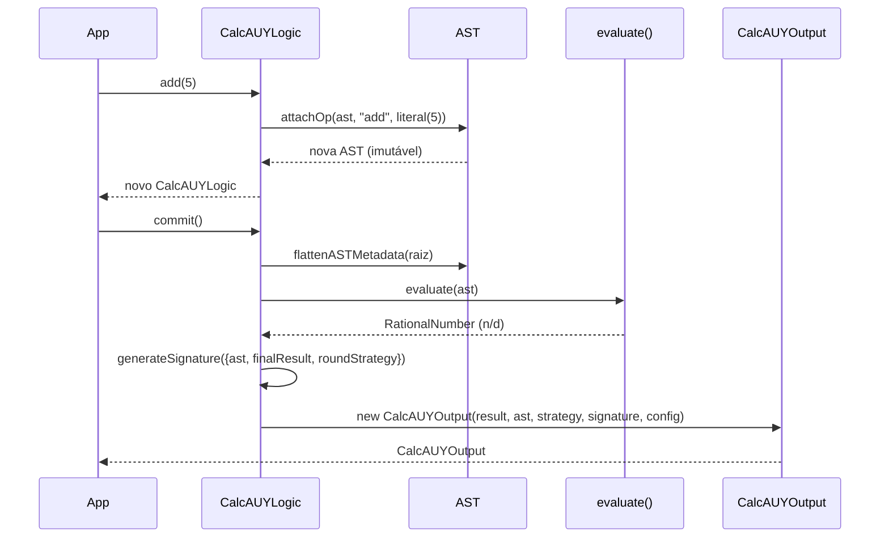

# 10 - API Fluida de Construção de Cálculo (CalcAUYLogic)


```mermaid
flowchart LR
    Create["CalcAUY.create(config)"] --> From["from(value)"]
    From --> Build["Árvore AST (imutável)"]
    Build --> Op["add / sub / mult / div / pow / mod / divInt"]
    Op --> Meta["setMetadata(key, value)"]
    Meta --> Group["group()"]
    Group --> Persist["hibernate()"]
    Persist --> Hydrate["hydrate(data)"]
    Hydrate --> Commit["commit()"]
    Commit --> Output["CalcAUYOutput"]
```

## 1. Visão Geral

`CalcAUYLogic<Context, Config>` é o *builder fluente* da CalcAUY. Implementa o padrão **Builder** com encadeamento de métodos (`method chaining`) sobre uma árvore sintática abstrata (AST) imutável. Cada operação retorna uma nova instância — nunca modifica a anterior — garantindo **imutabilidade por contrato** e segurança em ambientes concorrentes.

```typescript
// src/builder.ts:71-76
export class CalcAUYLogic<Context extends string, Config extends InstanceConfig = InstanceConfig> {
    readonly #ast: CalculationNode | null;
    readonly #instanceId: symbol;
    readonly #config: Required<InstanceConfig>;
    readonly #birthTime: string | null;
    readonly #metadataSize: number;
}
```

### 1.1 Parâmetros Genéricos

| Parâmetro | Finalidade |
|-----------|------------|
| `Context extends string` | *Brand* nominal: previne mistura de instâncias de contextos diferentes em tempo de compilação |
| `Config extends InstanceConfig` | Reifica o tipo exato da configuração para inferência precisa de `salt`, `roundStrategy` e `encoder` |

### 1.2 Campos Privados

| Campo | Tipo | Descrição |
|-------|------|-----------|
| `#ast` | `CalculationNode \| null` | Raiz da AST; `null` indica instância vazia (pré-`from()`) |
| `#instanceId` | `symbol` | Identificador único de jurisdição; comparado em `validateInstance()` |
| `#config` | `Required<InstanceConfig>` | Configuração mesclada com defaults — vide `src/main.ts:51-53` |
| `#birthTime` | `string \| null` | Timestamp ISO 8601 do nascimento da árvore; `null` em instâncias vazias |
| `#metadataSize` | `number` | Acumulador de bytes de metadados; validado contra `MAX_METADATA_BYTES` |

## 2. Criação da Instância (`CalcAUY.create`)

`src/main.ts:41-58` — A fábrica `CalcAUY.create()` valida o `contextLabel`, mescla com `DEFAULT_INSTANCE_CONFIG`, gera um `Symbol` único como identidade de jurisdição e retorna uma instância vazia de `CalcAUYLogic`.

```typescript
public static create<const T extends InstanceConfig & { contextLabel: string }>(
    config: T,
): CalcAUYLogic<T["contextLabel"], T> {
    if (!config || typeof config.contextLabel !== "string" || config.contextLabel.trim() === "") {
        throw new CalcAUYError("invalid-syntax",
            "O parâmetro 'contextLabel' é obrigatório e deve ser uma string não vazia.");
    }

    const fullConfig: Required<InstanceConfig> = {
        ...DEFAULT_INSTANCE_CONFIG,  // salt: "", encoder: "HEX", roundStrategy: "NBR5891", sensitive: true
        ...config,
    };

    const instanceId = Symbol(fullConfig.contextLabel);
    return new CalcAUYLogic<T["contextLabel"], T>(null, instanceId, fullConfig, null);
}
```

### 2.1 Contrato de `InstanceConfig`

`src/core/types.ts:16-42`:

| Campo | Tipo | Default | Descrição |
|-------|------|---------|-----------|
| `contextLabel` | `string` | — (obrigatório) | Rótulo amigável para identificar jurisdição |
| `salt` | `string` | `""` | Sal secreto para assinatura BLAKE3 |
| `roundStrategy` | `RoundingStrategy` | `"NBR5891"` | Estratégia de arredondamento padrão |
| `encoder` | `"HEX" \| "BASE64" \| "BASE58" \| "BASE32"` | `"HEX"` | Codificação da assinatura |
| `sensitive` | `boolean` | `true` | Modo de privacidade (oculta valores em logs) |
| `[BIRTH_TICKET_MOCK]` | `string` | `undefined` | Timestamp determinístico para testes |

## 3. Ingestão de Valores

### 3.1 `from(value)`

`src/builder.ts:146-218` — Método principal de ingestão. Aceita `InputValue<Context, Config>`:

```typescript
export type InputValue<C extends string, P extends InstanceConfig = InstanceConfig> =
    | string
    | number
    | bigint
    | CalcAUYLogic<C, P>;
```

**Fluxo de cache de nós literais** (prioridade decrescente):

1. **Hot Cache** (`hotLiteralNodeCache: Map<string, LiteralNode>`, limite `HOT_CACHE_LIMIT = 512`) — busca O(1), sem overhead de `WeakRef.deref()`.
2. **Cold Cache** (`globalLiteralNodeCache: Map<string, WeakRef<LiteralNode>>`) — usa `WeakRef` para permitir GC de nós órfãos.
3. **Criação** via `#createBaseNode(input)`:

```typescript
#createBaseNode(input: string): LiteralNode {
    const r: RationalNumber = RationalNumber.from(input);
    return {
        kind: "literal",
        value: r.toJSON() as RationalValue,
        originalInput: input,
    };
}
```

A `FinalizationRegistry` (`astCacheRegistry` em `src/builder.ts:39-41`) garante limpeza automática de chaves órfãs no cache global quando um `LiteralNode` é coletado pelo GC.

**Caso especial**: se `value` for outra instância `CalcAUYLogic`, o método verifica `validateInstance()` e, se a instância atual estiver vazia (`#ast === null`), adota a AST alheia diretamente.

### 3.2 `parseExpression(expression)`

`src/builder.ts:247-264` — Parsing de expressões matemáticas em string via `Lexer` + `Parser` (recursive descent).

```typescript
public parseExpression(expression: string): CalcAUYLogic<Context, Config> {
    const lexer: Lexer = new Lexer(expression);
    const tokens = lexer.tokenize();
    const parser: Parser = new Parser(tokens);
    const newNode = parser.parse();
    // ...
}
```

O parser (detalhado em `specs/03-Parser-Rules.md`) aceita literais numéricos, operadores (`+`, `-`, `*`, `/`, `^`, `%`, `//`) e parênteses. Variáveis não são suportadas — use interpolação de string.

## 4. Operações Aritméticas (Fluent API)

Todos os métodos aritméticos delegam ao método privado `op(type, value)`:

```typescript
// src/builder.ts:774-809
private op(type: OperationType, value: InputValue<Context, Config>): CalcAUYLogic<Context, Config> {
    const ast = this.assertAST();
    let rightNode: CalculationNode;
    // ...

    if (value instanceof CalcAUYLogic) {
        this.validateInstance(value);
        // Auto-grouping: se a AST interna não for group/literal, embrulha em GroupNode
        const innerAST = value.assertAST();
        if (innerAST.kind === "group" || innerAST.kind === "literal") {
            rightNode = innerAST;
        } else {
            rightNode = { kind: "group", child: innerAST };
        }
    } else {
        // Literal direto
        const r: RationalNumber = RationalNumber.from(value);
        rightNode = { kind: "literal", value: r.toJSON() as RationalValue, originalInput: value.toString() };
    }

    const newAST: CalculationNode = attachOp(ast, type, rightNode);
    return new CalcAUYLogic<Context, Config>(newAST, this.#instanceId, this.#config, this.#birthTime);
}
```

### 4.1 Métodos de Operação

| Método | `OperationType` | Descrição |
|--------|----------------|-----------|
| `add(value)` | `"add"` | Adição |
| `sub(value)` | `"sub"` | Subtração |
| `mult(value)` | `"mul"` | Multiplicação |
| `div(value)` | `"div"` | Divisão |
| `pow(value)` | `"pow"` | Potenciação |
| `mod(value)` | `"mod"` | Módulo (resto) |
| `divInt(value)` | `"divInt"` | Divisão inteira |

### 4.2 Hierarchical Flattening

`src/ast/builder_utils.ts:218-273` — A função `attachOp()` implementa um algoritmo de **aplanamento associativo inteligente**:

- Se o nó atual já for do mesmo tipo e não tiver metadados, o novo operando é simplesmente anexado ao array `operands` (desde que `operands.length < MAX_OPERANDS` que é 100).
- **Efeito**: sequências lineares massivas (ex: `a.add(b).add(c).add(d)...`) mantêm profundidade O(log N) em vez de O(N), evitando stack overflow e reduzindo o custo de cópia de O(N²) para O(N).
- Potência (`pow`) é tratada como **associativa à direita** — sempre cria novo nível.

### 4.3 Precedência

`src/ast/builder_utils.ts:17-26`:

```typescript
export const PRECEDENCE: Record<OperationType, number> = {
    pow: 2,   // maior precedência
    mul: 3, div: 3, divInt: 3, mod: 3,
    add: 4, sub: 4, crossContextAdd: 4,  // menor precedência
};
```

## 5. Agrupamento e Metadados

### 5.1 `group()`

`src/builder.ts:667-685` — Envolve a AST atual em um `GroupNode`. Se a raiz já for `group` ou `literal`, retorna `this` (operação idempotente).

```typescript
public group(): CalcAUYLogic<Context, Config> {
    const ast = this.assertAST();
    if (ast.kind === "group" || ast.kind === "literal") { return this; }

    const node: GroupNode = { kind: "group", child: ast };
    return new CalcAUYLogic<Context, Config>(node, this.#instanceId, this.#config, this.#birthTime);
}
```

### 5.2 `setMetadata(key, value)`

`src/builder.ts:635-655` — Anexa metadados ao nó atual via **prototype chain** (`Object.create`). O valor é validado por `validateMetadata()` em `src/core/metadata.ts`:

- **Permitidos**: `string`, `number`, `boolean`, arrays, plain objects
- **Proibidos**: `null`, `undefined`, `bigint`, `function`, `symbol`, `Date`, `RegExp`, class instances
- **Limite**: `MAX_METADATA_BYTES = 16384` (16 KB por nó)

```typescript
public setMetadata(key: string, value: MetadataValue): CalcAUYLogic<Context, Config> {
    const valSize = validateMetadata(value);
    const ast = this.assertAST();
    const newAST: CalculationNode = {
        ...ast,
        metadata: Object.assign(Object.create(ast.metadata || null), { [key]: value }),
    } as CalculationNode;
    return new CalcAUYLogic<Context, Config>(newAST, this.#instanceId, this.#config, this.#birthTime, totalSize);
}
```

## 6. Persistência e Reidratação

### 6.1 `hibernate()`

`src/builder.ts:402-424` — Serializa a AST em JSON assinado:

1. Achata a cadeia de protótipos dos metadados via `flattenASTMetadata()` (`src/ast/builder_utils.ts:165-201`)
2. Injeta `birthTime` como `metadata.timestamp`
3. Gera assinatura BLAKE3 via `generateSignature(ast, salt, encoder)` (`src/utils/security.ts:160-183`)
4. Retorna `JSON.stringify({ ast, signature, contextLabel })`

```typescript
public async hibernate(): Promise<string> {
    const root = this.assertAST();
    const flattenedRoot = flattenASTMetadata(root);
    const ast = this.#birthTime
        ? { ...flattenedRoot, metadata: { ...flattenedRoot.metadata, timestamp: this.#birthTime } }
        : flattenedRoot;
    const signature = await generateSignature(ast, this.#config.salt, this.#config.encoder);
    return JSON.stringify({ ast, signature, contextLabel: this.#config.contextLabel });
}
```

### 6.2 `hydrate(data, config?)`

`src/builder.ts:307-365` — Reconstrói uma instância a partir de estado serializado:

1. Parseia JSON (se string)
2. Extrai e valida assinatura (`payload.signature`)
3. Decide se é **audit trace** (com `finalResult` + `roundStrategy`) ou **hibernação** (só AST)
4. Gera hash esperado via `generateSignature(dataToVerify, salt, encoder)`
5. Compara: se divergir, lança `CalcAUYError("integrity-critical-violation")`
6. Valida estrutura da AST com `validateASTNode()` — verifica `MAX_HYDRATE_DEPTH` (500), `MAX_HYDRATE_NODES` (1000), detecção de ciclos
7. Envolve em `ControlNode` (com metadados `previousContextLabel`, `previousSignature`, `previousRoundStrategy`) + `GroupNode`

### 6.3 `fromExternalInstance(data)`

`src/builder.ts:489-555` — Gateway seguro para mesclar cálculos de diferentes jurisdições:

- Se for instância viva → chama `hibernate()` internamente para obter assinatura
- Se for string/objeto → parseia e valida assinatura
- Sempre envolve em `ControlNode` com metadados de procedência + `GroupNode`
- Preserva linhagem forense: contexto original, assinatura original, estratégia original

## 7. Execução (`commit()`)

`src/builder.ts:821-849` — Finaliza a construção e inicia a avaliação:

```typescript
public async commit(): Promise<CalcAUYOutput> {
    const root = this.assertAST();
    const flattenedRoot = flattenASTMetadata(root);
    const ast = this.#birthTime
        ? { ...flattenedRoot, metadata: { ...flattenedRoot.metadata, timestamp: this.#birthTime } }
        : flattenedRoot;

    const roundStrategy: RoundingStrategy = this.#config.roundStrategy;
    const result: RationalNumber = evaluate(ast);

    // Assina { ast, finalResult, roundStrategy }
    const payload = { ast, finalResult: result.toJSON(), roundStrategy };
    const signature = await generateSignature(payload, this.#config.salt, this.#config.encoder);

    return new CalcAUYOutput(result, ast, roundStrategy, signature, this.#config);
}
```

A avaliação da AST é feita por `evaluate(ast)` em `src/ast/engine.ts`, que percorre recursivamente a árvore executando operações com `RationalNumber`. **Todas as operações usam BigInt** (`n/d`) — sem perda de precisão até o momento do arredondamento.

## 8. Validação de Instância

`src/builder.ts:736-747`:

```typescript
private validateInstance(other: CalcAUYLogic<string, InstanceConfig>): void {
    if (other.#instanceId !== this.#instanceId) {
        throw new CalcAUYError("instance-mismatch",
            `Tentativa de misturar instâncias de contextos diferentes. Use 'fromExternalInstance' para integração cross-contexto.`,
            { currentContext: this.#config.contextLabel, otherContext: other.#config.contextLabel });
    }
}
```

A comparação usa `Symbol` — dois `Symbol` com a mesma descrição **não são iguais**. Isso garante que mesmo instâncias criadas com o mesmo `contextLabel` e `salt` sejam consideradas jurisdições distintas, a menos que sejam exatamente o mesmo objeto `Symbol` (i.e., mesma chamada de `CalcAUY.create()`).

## 9. Diagrama de Sequência (commit)


```mermaid
sequenceDiagram
    participant App
    participant Builder as CalcAUYLogic
    participant AST as AST
    participant Engine as evaluate()
    participant Output as CalcAUYOutput

    App->>Builder: add(5)
    Builder->>AST: attachOp(ast, "add", literal(5))
    AST-->>Builder: nova AST (imutável)
    Builder-->>App: novo CalcAUYLogic

    App->>Builder: commit()
    Builder->>AST: flattenASTMetadata(raiz)
    Builder->>Engine: evaluate(ast)
    Engine-->>Builder: RationalNumber (n/d)
    Builder->>Builder: generateSignature({ast, finalResult, roundStrategy})
    Builder->>Output: new CalcAUYOutput(result, ast, strategy, signature, config)
    Output-->>App: CalcAUYOutput
```

## 10. Referências

| Arquivo | Linhas | Conteúdo |
|---------|--------|----------|
| `src/builder.ts` | 1–850 | Implementação completa do `CalcAUYLogic` |
| `src/main.ts` | 41–58 | Fábrica `CalcAUY.create()` |
| `src/core/types.ts` | 16–42 | `InstanceConfig` |
| `src/core/constants.ts` | 1–60 | Constantes de limite (`MAX_OPERANDS`, `HOT_CACHE_LIMIT`, `MAX_METADATA_BYTES`) |
| `src/core/metadata.ts` | 1–95 | `validateMetadata()` |
| `src/ast/types.ts` | 1–97 | Tipos da AST (`LiteralNode`, `OperationNode`, `GroupNode`, `ControlNode`) |
| `src/ast/builder_utils.ts` | 165–274 | `flattenASTMetadata()`, `attachOp()`, `PRECEDENCE` |
| `src/utils/security.ts` | 160–183 | `generateSignature()` |
| `src/core/errors.ts` | 45–129 | `CalcAUYError` (RFC 7807) |

---

[↑ Voltar ao índice](../../index.md)
