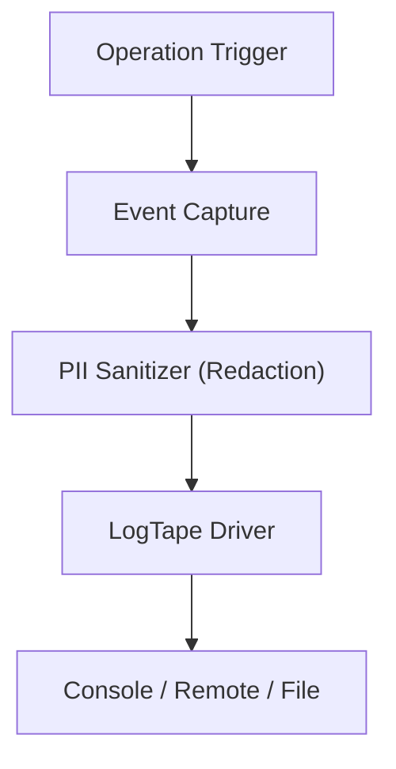

# 11 - Telemetria e Logs Estruturados (LogTape 2.0)



## Objetivo
Definir o padrão de instrumentação da biblioteca, garantindo que desenvolvedores e auditores possam monitorar o fluxo de execução, diagnosticar falhas e verificar a integridade da AST sem comprometer a performance ou a privacidade na CalcAUY.

## Configuração Global
A biblioteca utiliza o LogTape 2.0 de forma agnóstica.

### Namespace Raiz

Em `src/core/constants.ts:9-10`:

```ts
export const LIB_NAME = "calc-auy";
export const LOG_NAMESPACE = [LIB_NAME] as const;
// → ["calc-auy"]
```

### Logger Raiz e Sub-Loggers

Em `src/utils/logger.ts:10-22`:

```ts
import { getLogger, type Logger } from "@logtape";
import { LOG_NAMESPACE } from "../core/constants.ts";

export const logger: Logger = getLogger(LOG_NAMESPACE);

export function getSubLogger(subName: string): Logger {
    return getLogger([...LOG_NAMESPACE, subName]);
}
```

- **ID Global:** `getLogger(["calc-auy"])`
- **Namespaces:** Os logs devem ser organizados em sub-categorias para filtragem granular:
  - `["calc-auy", "engine", "..."]` (`getSubLogger("engine")`) — Para operações de construção da AST e colapso matemático. Usado em `src/builder.ts:34`.
  - `["calc-auy", "output", "..."]` (`getSubLogger("output")`) — Para processos de formatação, renderização e arredondamento. Usado em `src/output.ts:24`.
  - `["calc-auy", "parser"]` — Para validação e entrada de dados.
  - `["calc-auy", "error"]` (`getSubLogger("error")`) — Para exceções e erros. Usado em `src/core/errors.ts:13`.

## Níveis de Log e Gatilhos

### 1. Fase de Cálculo (Engine)
- **Nível:** `Debug`
- **Gatilho:** Cada operação de anexação na AST (`add`, `sub`, `pow`, etc.).
- **Conteúdo Requerido:**
  - `operation`: Nome da operação (ex: "add").
  - `ast_structure`: Representação estrutural da AST (tipos de nós e hierarquia, **sem valores literais ou metadados**).
  - `input_type`: Tipo do valor de entrada (string, number, CalcAUY).
- **Restrição de PII:** É proibido logar o conteúdo de `RationalValue` ou `MetadataValue`.
- **Exemplo real** (`src/builder.ts:800-808`):

```ts
if (logger.isEnabledFor("debug")) {
    logger.debug("Node appended to AST", {
        operation: type,
        input_type: inputType,
        structure: sanitizeAST(newAST, this.#config),
    });
}
```

### 2. Fase de Saída (Output)
- **Nível:** `Info`
- **Gatilho:** Chamada de qualquer método de exportação em `CalcAUYOutput`.
- **Conteúdo Requerido:**
  - `output_method`: O método chamado (ex: "toMonetary").
  - `options`: Parâmetros passados ao método (ex: `decimalPrecision`).
- **Restrição de PII:** Não deve logar o `final_ast` completo nem o `internal_value` real. O log serve apenas para métricas de uso e performance.

#### TelemetrySpan — Medição Automática de Performance

Em `src/utils/logger.ts:31-65`, a classe `TelemetrySpan` utiliza o protocolo `Disposable` (keyword `using` do TS 5.2+) para medir e logar automaticamente a duração de operações de output:

```ts
export class TelemetrySpan implements Disposable {
    readonly #name: string;
    readonly #logger: Logger;
    readonly #start: number;

    constructor(name: string, logger: Logger, options: unknown) {
        this.#name = name;
        this.#logger = logger;
        this.#options = options;
        this.#start = performance.now();
    }

    [Symbol.dispose](): void {
        if (!this.#logger.isEnabledFor("info")) { return; }
        const end = performance.now();
        const durationMs = `${(end - this.#start).toFixed(4)}ms`;
        this.#logger.info("Output generated", {
            output_method: this.#name,
            duration: durationMs,
            options: this.#options,
        });
    }
}
```

Uso em métodos de output (`src/output.ts:117`):

```ts
public toStringNumber(options?: OutputOptions): string {
    using _span = startSpan("toStringNumber", logger, options);
    return this.toStringNumberInternal(options);
}
```

### 3. Fase de Erro
- **Nível:** `Error` ou `Warn`
- **Gatilho:** Exceções disparadas (`CalcAUYError`).
- **Conteúdo Requerido:**
  - `error_type`: Categoria do erro (ex: "division-by-zero").
  - `partial_ast_structure`: Estrutura da árvore no momento da falha (sanitizada).
  - `operation_context`: Dados técnicos da falha (sanitizados).

#### Log Automático no Construtor do `CalcAUYError`

Em `src/core/errors.ts:92-101`:

```ts
if (logger.isEnabledFor("error")) {
    logger.error("CalcAUYLogic Exception Triggered", {
        error_type: this.type,
        instance: this.instance,
        status: this.status,
        detail: this.detail,
        cause: options?.cause,
        context: sanitizeObject(this.context),
    });
}
```

## Segurança e Anonimização (PII)

Para garantir conformidade com LGPD/GDPR e proteger dados sensíveis:
1. **Redação Obrigatória:** Todos os logs devem passar por um utilitário de sanitização que substitui valores numéricos e metadados por `[REDACTED]`.
2. **Máscara de Valores:** Embora o rastro matemático seja público no output da lib para o usuário, nos logs de infraestrutura ele deve ser ocultado.

### Utilitários de Sanitização

Em `src/utils/sanitizer.ts`:

**`sanitizeAST(node, config, parentHide?)`** — Sanitiza a estrutura da AST recursivamente, substituindo valores literais e metadados por `"PII"`:

```ts
export function sanitizeAST(
    node: CalculationNode,
    config: InstanceConfig = DEFAULT_INSTANCE_CONFIG,
    parentHide?: boolean,
): object {
    // ...
    if (node.kind === "literal") {
        sanitized.value = hide ? { n: "[PII]", d: "[PII]" } : node.value;
        sanitized.originalInput = hide ? "[PII]" : node.originalInput;
    }
    // ...
}
```

**`sanitizeObject(obj, config, seen?)`** — Sanitiza objetos genéricos como `ErrorContext`, protegendo contra dados sensíveis como `"rawInput"`, `"n"`, `"d"`, `"metadata"`, `"originalInput"`, `"secret"`:

```ts
const SENSITIVE_KEYS = new Set(["n", "d", "rawInput", "metadata", "value", "originalInput", "secret"]);
```

Além disso, detecta e substitui por `"[PII]"`:
- Qualquer string que corresponda ao padrão numérico `NUMERIC_RE`
- Qualquer string com mais de 50 caracteres
- Valores `number` ou `bigint`
- Referências circulares são substituídas por `"[CIRCULAR]"`

## Estrutura Visual do Log no Console
```text
[DEBUG] calc-auy.engine.pow: Exponenciação adicionada à AST. { assoc: "right", nodes: 3 }
[INFO]  calc-auy.output.latex: LaTeX gerado com sucesso. { formula: "\frac{x}{y}", duration: "2ms" }
[ERROR] calc-auy.error: CalcAUYLogic Exception Triggered { error_type: "calc-auy/division-by-zero", instance: "urn:uuid:...", status: 422 }
```

## Benefícios para Auditoria
Ao registrar a AST em cada passo do `engine` no nível `Debug`, é possível reconstruir visualmente a "árvore de decisão" do programador que montou o cálculo, permitindo identificar exatamente onde uma precedência foi mal aplicada ou um agrupamento foi esquecido.

### Performance: Gate de Nível Antes da Montagem

Todos os logs utilizam `isEnabledFor()` para evitar custo desnecessário de serialização:

```ts
if (logger.isEnabledFor("debug")) {  // ← Gate: só monta o objeto se o nível estiver ativo
    logger.debug("...", { ... });
}
```

Isso garante que em produção (onde `debug` geralmente está desligado) o overhead de log seja zero.

---

[↑ Voltar ao índice](../index.md)
