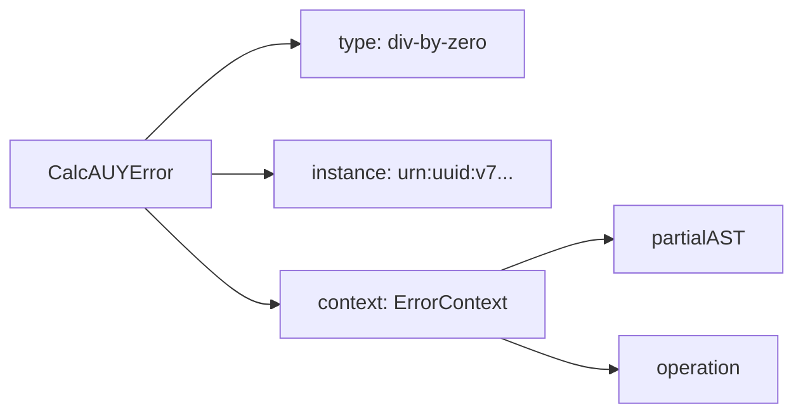

# 12 - Sistema de Erros e Diagnósticos (CalcAUYError)



## Objetivo
Definir a arquitetura de tratamento de exceções da biblioteca, garantindo que qualquer falha (seja no parsing, cálculo ou output) forneça metadados suficientes para auditoria forense e recuperação de estado na CalcAUY.

## Padrão de Representação (RFC 7807)
A classe `CalcAUYError` deve ser serializável e compatível com o padrão de "Problem Details" ([RFC 7807](https://datatracker.ietf.org/doc/html/rfc7807)), facilitando o transporte via HTTP em aplicações distribuídas.

### Implementação Real — `src/core/errors.ts:45-130`

```ts
export class CalcAUYError extends Error {
    public readonly type: string;       // URI do tipo de erro
    public readonly title: string;      // Resumo legível
    public readonly status: number;     // Código HTTP sugerido
    public readonly detail: string;     // Explicação detalhada
    public readonly instance: string;   // UUID v7 único
    public readonly context: ErrorContext; // Estado técnico

    public constructor(
        category: ErrorCategory,
        detail: string,
        context: ErrorContext = {},
        options?: ErrorOptions,
    ) {
        super(detail, options);
        this.type = `https://github.com/st-all-one/calc-auy/blob/main/wiki/errors/${category}.md`;
        this.title = category;
        this.detail = detail;
        this.context = context;
        this.instance = `urn:uuid:${uuidV7.generate()}`;
        // ...
    }
}
```

### Estrutura da Classe `CalcAUYError`
- `type: string` (URI ou identificador único do erro, ex: `calc-auy/division-by-zero`).
- `title: string` (Resumo curto e legível por humanos).
- `status: number` (Sugestão de código HTTP equivalente, ex: 400 para Parser, 422 para Cálculo).
- `detail: string` (Explicação detalhada da causa da falha).
- `instance: string` (UUID-V7 único da ocorrência do erro para correlação temporal em logs).
- `context: ErrorContext` (Objeto contendo o estado técnico do erro).

### Geração de UUID v7

Em `src/core/errors.ts:9`, o UUID v7 é gerado pela lib `@std/uuid`:

```ts
import { v7 as uuidV7 } from "@std/uuid";
// ...
this.instance = `urn:uuid:${uuidV7.generate()}`;
```

O UUID v7 é baseado em timestamp Unix (milissegundos), permitindo ordenação cronológica intrínseca dos erros — ideal para auditoria forense.

## Categorias de Erros e Severidade

### Tipo `ErrorCategory` — `src/core/errors.ts:16-27`

```ts
export type ErrorCategory =
    | "invalid-syntax"
    | "unsupported-type"
    | "division-by-zero"
    | "complex-result"
    | "invalid-precision"
    | "corrupted-node"
    | "integrity-critical-violation"
    | "instance-mismatch"
    | "math-overflow"
    | "metadata-overflow"
    | "circular-dependency";
```

### Mapeamento HTTP Status — `src/core/errors.ts:74-86`

```ts
const statusMap: Record<ErrorCategory, number> = {
    "invalid-syntax": 400,
    "unsupported-type": 400,
    "division-by-zero": 422,
    "complex-result": 422,
    "invalid-precision": 400,
    "corrupted-node": 500,
    "integrity-critical-violation": 500,
    "instance-mismatch": 403,
    "math-overflow": 422,
    "metadata-overflow": 413,
    "circular-dependency": 422,
};
```

| Categoria | Tipo | Descrição | HTTP Status | Severidade |
| :--- | :--- | :--- | :--- | :--- |
| **Parser** | `invalid-syntax` | Erro de gramática na string de entrada. | 400 | Alta |
| **Input** | `unsupported-type` | Valor de entrada não permitido (ex: null, object). | 400 | Média |
| **Math** | `division-by-zero` | Tentativa de divisão por zero em qualquer nó. | 422 | Crítica |
| **Math** | `complex-result` | Operação resultou em número complexo não suportado. | 422 | Média |
| **Math** | `math-overflow` | Resultado excede 1M bits (`MAX_BI_BITS`). | 422 | Crítica |
| **Output** | `invalid-precision` | Precisão decimal negativa ou inválida solicitada. | 400 | Baixa |
| **AST** | `corrupted-node` | Tentativa de hidratar uma AST com estrutura inválida. | 500 | Alta |
| **Security** | `integrity-critical-violation` | Assinatura inválida ou adulteração detectada. | 500 | Crítica |
| **Security** | `instance-mismatch` | Tentativa de misturar contextos distintos. | 403 | Alta |
| **AST** | `metadata-overflow` | Metadados excedem 16KB por nó (`MAX_METADATA_BYTES`). | 413 | Média |
| **AST** | `circular-dependency` | Estrutura cíclica detectada na AST. | 422 | Alta |

## O Contexto de Diagnóstico (`ErrorContext`)

### Tipo `ErrorContext` — `src/core/errors.ts:30-35`

```ts
export type ErrorContext = {
    operation?: string;     // Nome da operação que falhou (ex: "pow", "div")
    rawInput?: unknown;     // Valor bruto que causou a exceção
    partialAST?: unknown;   // Estado da AST no momento da falha
    [key: string]: unknown; // Metadados extras adicionais
};
```

Para cada erro disparado, o motor deve anexar o máximo de informações possível:
- `operation`: Nome da operação que falhou (ex: `pow`, `div`).
- `partialAST`: O estado da árvore AST no momento exato da falha (se disponível).
- `rawInput`: O valor bruto que causou a exceção.
- `stack`: Pilha de execução (preservada da exceção original).

### Exemplos de Uso do Contexto

**Divisão por zero** (`src/core/rational.ts:103-105`):
```ts
throw new CalcAUYError("division-by-zero", "O denominador não pode ser zero.");
```

**Overflow** (`src/core/rational.ts:141-146`):
```ts
throw new CalcAUYError(
    "math-overflow",
    `O resultado da operação excede o limite de segurança de ${MAX_BI_BITS} bits.`,
);
```

**Instance mismatch** (`src/builder.ts:737-747`):
```ts
throw new CalcAUYError(
    "instance-mismatch",
    `Attempted to mix instances from different contexts. Use 'fromExternalInstance' for cross-context integration.`,
    {
        currentContext: this.#config.contextLabel,
        otherContext: other.#config.contextLabel,
    },
);
```

## Handler de Captura e Telemetria

A biblioteca deve fornecer um utilitário interno de tratamento:
1. **Interceptação:** Captura erros nativos (como `BigInt` division by zero) e os encapsula em `CalcAUYError`.
2. **Sanitização Obrigatória:** Antes de qualquer log, o `ErrorContext` deve ser processado para remover ou redigir (`[REDACTED]`) valores literais e metadados sensíveis.
3. **Log Automático:** Dispara imediatamente o `getLogger(["calc-auy", "error"]).error()` com dados sanitizados, conforme definido no `specs/11`.

### Sanitização Automática no Construtor

Em `src/core/errors.ts:91-101`, o próprio construtor do `CalcAUYError` já realiza o log sanitizado:

```ts
const logger = getSubLogger("error");

// No construtor:
if (logger.isEnabledFor("error")) {
    logger.error("CalcAUYLogic Exception Triggered", {
        error_type: this.type,
        instance: this.instance,
        status: this.status,
        detail: this.detail,
        cause: options?.cause,
        context: sanitizeObject(this.context),  // ← PII removido automaticamente
    });
}
```

A função `sanitizeObject()` (de `src/utils/sanitizer.ts`) percorre o objeto substituindo:
- Campos sensíveis (`rawInput`, `n`, `d`, `metadata`, `value`, `originalInput`, `secret`) por `"[PII]"`
- Strings numéricas por `"[PII]"`
- Números e BigInts por `"[PII]"`
- Strings > 50 caracteres por `"[PII]"`
- Referências circulares por `"[CIRCULAR]"`

## Exemplo de JSON de Erro (Serializado)

```json
{
  "type": "calc-auy/division-by-zero",
  "title": "Erro Matemático Crítico",
  "status": 422,
  "detail": "Não é possível dividir o numerador 100 pelo denominador 0.",
  "instance": "urn:uuid:66f97d51-3827-4648",
  "context": {
    "operation": "div",
    "rawInput": "0",
    "partialAST": { "type": "literal", "value": { "n": "100", "d": "1" } }
  }
}
```

### Método `toJSON()` — `src/core/errors.ts:120-129`

```ts
public toJSON(): Record<string, unknown> {
    return {
        type: this.type,
        title: this.title,
        status: this.status,
        detail: this.detail,
        instance: this.instance,
        context: this.context,
    };
}
```

## Benefícios para Auditoria
Diferente de um `Error` genérico, o `CalcAUYError` permite que um desenvolvedor capture a exceção e mostre ao usuário final (ou auditor) exatamente qual parte da fórmula causou o problema, incluindo a visualização LaTeX da sub-expressão que falhou.

### Herança de `Error` Nativo
`CalcAUYError` estende `Error`, portanto:
- Preserva `stack` trace nativo
- Funciona com `instanceof CalcAUYError`
- Compatível com `try/catch` e `ErrorOptions` (cause chain)

```ts
try {
    await calc.parseExpression("10 ++ 5").commit();
} catch (err) {
    if (err instanceof CalcAUYError) {
        sendToAudit(err.toJSON());
    }
}
```

---

[↑ Voltar ao índice](../index.md)
