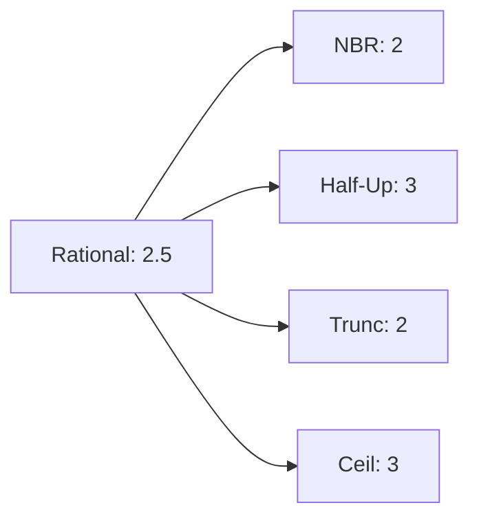

# 13 - Estratégias de Arredondamento e Identificadores Visuais



## Objetivo
Definir os algoritmos de arredondamento suportados pela CalcAUY 2.0, garantindo que o colapso do `RationalNumber` para a precisão de saída seja determinístico, auditável e visualmente identificado em todos os formatos.

## Catálogo de Estratégias

### Constantes de Identificação — `src/core/constants.ts:19-26`

```ts
export const ROUNDING_IDS = {
    NBR5891: "NBR-5891",
    HALF_UP: "HALF-UP",
    HALF_EVEN: "HALF-EVEN",
    TRUNCATE: "TRUNCATE",
    CEIL: "CEIL",
    NONE: "NONE",
} as const;

export type RoundingStrategy = keyof typeof ROUNDING_IDS;
```

| Estratégia | ID Visual | Chave `RoundStrategy` | Descrição Matemática |
| :--- | :--- | :--- | :--- |
| **NBR-5891** | `NBR` | `NBR5891` | Norma Brasileira: Arredondamento ao par mais próximo em caso de 0.5 exato. |
| **Half-Up** | `HU` | `HALF_UP` | Comercial: 0.5 ou superior arredonda para cima (longe do zero). |
| **Half-Even** | `HE` | `HALF_EVEN` | Bancário: Arredonda para o número par mais próximo (elimina viés estatístico). |
| **Truncate** | `TR` | `TRUNCATE` | Corte Seco: Simplesmente descarta os decimais excedentes (direção ao zero). |
| **Ceil** | `CE` | `CEIL` | Teto: Arredonda sempre para o maior inteiro seguinte (direção ao infinito positivo). |
| **None** | `--` | `NONE` | Nenhum: Mantém o valor racional puro sem arredondamento. Útil para auditoria que exige o valor exato. |

## Representação nos Outputs

Para garantir a transparência da auditoria, o identificador da estratégia deve acompanhar o resultado final nos formatos visuais.

### 1. LaTeX
A estratégia aparece como um subscrito no operador `\text{round}`.
- **Formato:** `\text{round}_{\text{ID}}(base, precisão) = resultado`
- **Exemplo (NBR):** `\text{round}_{\text{NBR-5891}}(1.225, 2) = 1.22`

Código real em `src/output.ts:312-326`:

```ts
private toLaTeXInternal(options?: OutputOptions): string {
    const p: number = this.getEffectivePrecision(options);
    const base: string = renderAST(this.#ast, "latex");
    let roundedStr: string = this.toStringNumberInternal(options);
    roundedStr = roundedStr.replace(/%/g, String.raw`\%`);
    const strategyName: string = ROUNDING_IDS[this.#roundStrategy];
    return String.raw`\text{round}_{\text{${strategyName}}}(${base}, ${p}) = ${roundedStr}`;
}
```

### 2. HTML (KaTeX)
Renderização rica com acessibilidade.
- **Visual:** $\text{round}_{\text{NBR-5891}}$
- **A11y:** O `aria-label` do fragmento inclui a estratégia por extenso.

### 3. Unicode (CLI/Logs)
Utiliza glifos subscritos para o identificador.
- **Mapeamento:** `HU` -> `ₕᵤ`, `HE` -> `ₕₑ`, `TR` -> `ₜᵣ`, `CE` -> `꜀ₑ`, `NBR` -> `ₙᵦᵣ₋₅₈₉₁`.
- **Exemplo:** `roundₙᵦᵣ₋₅₈₉₁(1.225, 2) = 1.22`

Código real em `src/output.ts:348-360`:

```ts
private toUnicodeInternal(options?: OutputOptions): string {
    const base: string = renderAST(this.#ast, "unicode");
    const strategyName: string = ROUNDING_IDS[this.#roundStrategy];
    const subStrategy: string = toSubscript(strategyName);
    return `round${subStrategy}(${base}, ${p}) = ${this.toStringNumberInternal(options)}`;
}
```

### 4. Verbal (A11y)
Deve ser por extenso e localizado.
- **Exemplo:** "... arredondado via Norma Brasileira NBR-5891 para duas casas decimais."

Código real em `src/output.ts:445-453`:

```ts
private toVerbalA11yInternal(options?: OutputOptions, customLocale?: CalcAUYLocaleA11y): string {
    const strategyName: string = ROUNDING_IDS[this.#roundStrategy];
    const { phrases } = loc;
    return `${base}${phrases.isEqual}${finalValueStr} (${phrases.rounding}: ${strategyName} ${phrases.for} ${p} ${phrases.decimalPlaces}).`;
}
```

### 5. ImageBuffer (SVG)
O renderizador SVG deve garantir que o identificador subscrito (NBR, HU, etc.) seja renderizado com clareza, utilizando fontes monoespaçadas ou KaTeX integrado para evitar confusão visual.

## Implementação na AST e RationalNumber

### O Arredondamento Acontece no Output, Não no `commit()`

O arredondamento **não** ocorre no `commit()` — o método apenas avalia a AST e armazena o `RationalNumber` bruto. A estratégia de arredondamento (definida em `create({ roundStrategy })`) é aplicada apenas nos métodos de saída como `toStringNumber()`, onde a `decimalPrecision` é informada.

Em `src/output.ts:77-84`, o método privado `getRounded()` aplica o arredondamento sob demanda com cache:

```ts
private getRounded(precision: number): RationalNumber {
    if (!this.#cache.has(precision)) {
        const rounded: RationalNumber = applyRounding(this.#result, this.#roundStrategy, precision);
        this.#cache.set(precision, rounded);
    }
    return this.#cache.get(precision)!;
}
```

### `RationalNumber` Bruto vs Arredondado

O `commit()` em `src/builder.ts:821-849` retorna o valor racional exato:

```ts
public async commit(): Promise<CalcAUYOutput> {
    const result: RationalNumber = evaluate(ast);
    // Apenas armazena — sem arredondamento
    return new CalcAUYOutput(result, ast, roundStrategy, signature, this.#config);
}
```

### Estratégia Default e Lógica de Precisão

Em `src/output.ts:86-89`:

```ts
private getEffectivePrecision(options?: OutputOptions): number {
    if (options?.decimalPrecision !== undefined) { return options.decimalPrecision; }
    return this.#roundStrategy === "NONE" ? 50 : DEFAULT_DECIMAL_PRECISION;
}
```

- Se `decimalPrecision` for fornecida nas opções, usa-a.
- Se a estratégia for `NONE`, usa 50 casas (precisão máxima).
- Caso contrário, usa `DEFAULT_DECIMAL_PRECISION = 2` (`src/core/constants.ts:17`).

## Implementação dos Algoritmos de Arredondamento

### `RoundingHandlers` — `src/core/rounding.ts:39-173`

```ts
export const RoundingHandlers: Record<
    RoundingStrategy,
    (val: RationalNumber, precision: number) => RationalNumber
> = { ... };
```

### Caches de Potências de 10 — `src/core/rounding.ts:17-26`

Para evitar recálculo de `10^n` e `10^n / 2` em cada chamada, arrays pré-computados de 128 entradas são usados:

```ts
const CACHE_ARRAY_SIZE = 128;  // src/core/constants.ts:44
const POWERS_CACHE: bigint[] = new Array(CACHE_ARRAY_SIZE);
const HALVES_CACHE: bigint[] = new Array(CACHE_ARRAY_SIZE);

POWERS_CACHE[0] = 1n;
HALVES_CACHE[0] = 0n;
for (let i = 1; i < CACHE_ARRAY_SIZE; i++) {
    const p = POWERS_CACHE[i - 1] * 10n;
    POWERS_CACHE[i] = p;
    HALVES_CACHE[i] = p / 2n;
}
```

A função `getPowerOf10()` (`src/core/rounding.ts:28-31`) usa o cache quando possível:

```ts
function getPowerOf10(p: number): bigint {
    if (p >= 0 && p < CACHE_ARRAY_SIZE) { return POWERS_CACHE[p]; }
    return 10n ** BigInt(p);
}
```

### Algoritmo: `applyRounding()` — `src/core/rounding.ts:178-185`

```ts
export function applyRounding(
    val: RationalNumber,
    roundStrategy: RoundingStrategy,
    precision: number,
): RationalNumber {
    const handler: (val: RationalNumber, p: number) => RationalNumber = RoundingHandlers[roundStrategy];
    return handler(val, precision);
}
```

### Algoritmos Individuais

1. **NBR-5891** (`src/core/rounding.ts:123-164`): Se o resto for exatamente 0.5, olha-se para o dígito anterior. Se for ímpar, arredonda. Se for par, mantém.

2. **Half-Up** (`src/core/rounding.ts:73-85`): Se o resto for >= 0.5, soma 1 ao inteiro.

3. **Half-Even** (`src/core/rounding.ts:92-116`): Idêntico ao NBR para casos genéricos, mas rigoroso na paridade do BigInt.

4. **Truncate** (`src/core/rounding.ts:47-51`): Ignora o resto.

5. **Ceil** (`src/core/rounding.ts:57-67`): Se houver qualquer resto positivo, soma 1 ao inteiro.

6. **None** (`src/core/rounding.ts:169-173`): Retorna o valor racional sem arredondamento. O `toStringNumber()` remove zeros à direita para evitar falsa precisão.

### Algoritmo de Baixo Nível: `roundToPrecisionNBR5891()` — `src/core/rounding.ts:196-227`

Função otimizada para BigInt que implementa a NBR 5891 diretamente sobre valores escalados:

```ts
export function roundToPrecisionNBR5891(
    value: bigint,
    currentPrecision: number,
    targetPrecision: number,
): bigint {
    const diff = currentPrecision - targetPrecision;
    if (diff <= 0) {
        if (diff === 0) { return value; }
        return value * getPowerOf10(-diff);
    }

    const isNegative = value < 0n;
    const absValue = isNegative ? -value : value;
    const divisor = getPowerOf10(diff);
    const halfDivisor = diff < CACHE_ARRAY_SIZE ? HALVES_CACHE[diff] : divisor / 2n;

    const integralPart = absValue / divisor;
    const remainder = absValue % divisor;

    let roundedAbs = integralPart;
    if (remainder > halfDivisor || (remainder === halfDivisor && (integralPart & 1n) !== 0n)) {
        roundedAbs++;
    }

    return isNegative ? -roundedAbs : roundedAbs;
}
```

**Fast-path:** Se `diff ≤ 0` (precisão alvo maior ou igual à atual), retorna o valor escalado sem arredondamento — apenas padding de zeros.

**Lógica NBR 5891:**
- `remainder > halfDivisor` (resto > 0.5) → incrementa
- `remainder === halfDivisor && integralPart` ímpar (resto == 0.5 e dígito anterior ímpar) → incrementa
- Caso contrário → mantém

### Precisão Interna (Late Rounding)

A precisão interna de 50 casas decimais é definida em `src/core/constants.ts:12`:

```ts
export const PRECISION_BIGINT = 50n;
export const SCALE_BIGINT = 10n ** PRECISION_BIGINT;
```

Isso significa que todas as operações matemáticas internas mantêm 50 casas decimais de precisão, e o arredondamento só ocorre na saída (late rounding), garantindo máxima fidelidade durante a cadeia de cálculos.

### Armazenamento na AST (Audit Trace)
O `ASTSnapshot` gerado pelo `toAuditTrace()` deve incluir a estratégia de arredondamento no nó raiz (CommitNode), permitindo que softwares de terceiros validem o cálculo seguindo a mesma regra.
```json
{
  "type": "commit",
  "roundStrategy": "NBR5891",
  "visual_id": "NBR",
  "final_value": { "n": "126", "d": "100" }
}
```

Estrutura real emitida por `toLiveTrace()` (`src/output.ts:208-220`):

```ts
private toLiveTraceInternal(): SerializedCalculation {
    return {
        ast: flattenASTMetadata(this.#ast),
        finalResult: this.getResultJSON(),
        roundStrategy: this.#roundStrategy,
        signature: this.#signature,
        contextLabel: this.#config.contextLabel,
    };
}
```

---

[↑ Voltar ao índice](../index.md)
