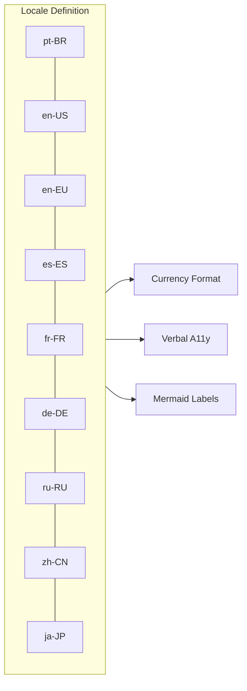

# 14 - Internacionalização: Locais e Moedas Padrão



## 1. Locais Suportados

`src/output_internal/i18n.ts:16-377` — Nove locais implementados no mapa `LOCALES` do tipo `Record<CalcAUYLocale, CalcAUYLocaleA11y>`:

| Locale | Moeda | Sep. Decimal | Sep. Milhar | Sep. Falado |
|--------|-------|-------------|-------------|-------------|
| `"pt-BR"` | `BRL` | `,` | `.` | ` vírgula ` |
| `"en-US"` | `USD` | `.` | `,` | ` point ` |
| `"en-EU"` | `EUR` | `,` | `.` | ` comma ` |
| `"es-ES"` | `EUR` | `,` | `.` | ` coma ` |
| `"fr-FR"` | `EUR` | `,` | ` ` (espaço) | ` virgule ` |
| `"de-DE"` | `EUR` | `,` | `.` | ` Komma ` |
| `"ru-RU"` | `RUB` | `,` | ` ` (espaço) | ` запятая ` |
| `"zh-CN"` | `CNY` | `.` | `,` | ` 点 ` |
| `"ja-JP"` | `JPY` | `.` | `,` | ` 点 ` |

### 1.1 Tipo `CalcAUYLocale`

`src/core/types.ts:47-56`:

```typescript
export type CalcAUYLocale =
    | "pt-BR" | "en-US" | "en-EU" | "es-ES" | "fr-FR"
    | "de-DE" | "ru-RU" | "zh-CN" | "ja-JP";
```

### 1.2 Função `getLocale()`

`src/output_internal/i18n.ts:382-384`:

```typescript
export function getLocale(code: CalcAUYLocale = DEFAULT_LOCALE as CalcAUYLocale): CalcAUYLocaleA11y {
    return LOCALES[code] || LOCALES[DEFAULT_LOCALE as CalcAUYLocale];  // fallback pt-BR
}
```

`DEFAULT_LOCALE` é `"pt-BR"` conforme `src/core/constants.ts:15`.

## 2. Interface `CalcAUYLocaleA11y`

`src/output_internal/types.ts:89-163` — Define a estrutura completa de um locale:

```typescript
export type CalcAUYLocaleA11y = {
    locale: string;                         // código do locale (ex: "pt-BR")
    currency: string;                       // moeda ISO 4217 (ex: "BRL")
    decimalSeparator: string;               // separador decimal ("," ou ".")
    voicedSeparator: string;                // termo falado (" vírgula ", " point ")
    thousandSeparator: string;              // separador de milhar (".", ",", " ")
    operators: {                            // dicionário de operadores
        add: string;                        // "mais", "plus", "加"
        sub: string;                        // "menos", "minus", "减"
        mul: string;                        // "multiplicado por", "multiplied by", "乘"
        div: string;                        // "dividido por", "divided by", "除"
        pow: string;                        // "elevado a", "to the power of", "次方"
        mod: string;                        // "módulo", "modulo", "取模"
        divInt: string;                     // "divisão inteira por", "integer division by", "整除"
        group_start: string;                // "abre parênteses", "open parenthesis", "左括号"
        group_end: string;                  // "fecha parênteses", "close parenthesis", "右括号"
    };
    phrases: {                              // frases e conectivos
        isEqual: string;                    // " é igual a ", " is equal to ", " 等于 "
        rounding: string;                   // "Arredondamento", "Rounding", "舍入"
        for: string;                        // "para", "for", "保留"
        decimalPlaces: string;              // "casas decimais", "decimal places", "位小数"
        root_square: string;                // "raiz quadrada de ", "square root of ", "平方根 "
        root_cubic: string;                 // "raiz cúbica de ", "cubic root of ", "立方根 "
        root_n: string;                     // "raiz {den}-ésima de ", "the {den}-th root of ", "{den}次方根 "
    };
    mermaid: {                              // termos para diagramas Mermaid
        context: string;                    // "Contexto", "Context", "上下文"
        handover: string;                   // "Handover", "Handover", "切换"
        ingestion: string;                  // "Ingestão", "Ingestion", "摄入"
        ingestionOperands: string;          // "Ingestão de Operandos", "Ingestion of Operands", "操作数摄入"
        operation: string;                  // "Operação", "Operation", "操作"
        event: string;                      // "Evento", "Event", "事件"
        closing: string;                    // "Fechamento e Assinatura Final"
        signature: string;                  // "Signature" (mantido em inglês em todos)
        today: string;                      // "Hoje", "Today", "今天"
        objectLabel: string;                // "[Objeto]", "[Object]", "[对象]"
        listTemplate: string;               // "[Lista: {n} itens]", "[List: {n} items]", "[列表: {n} 项]"
    };
};
```

### 2.1 Exemplo: Locale pt-BR

```typescript
"pt-BR": {
    locale: "pt-BR",
    currency: "BRL",
    decimalSeparator: ",",
    voicedSeparator: " vírgula ",
    thousandSeparator: ".",
    operators: {
        add: "mais", sub: "menos", mul: "multiplicado por",
        div: "dividido por", pow: "elevado a", mod: "módulo",
        divInt: "divisão inteira por",
        group_start: "abre parênteses", group_end: "fecha parênteses",
    },
    phrases: {
        isEqual: " é igual a ", rounding: "Arredondamento",
        for: "para", decimalPlaces: "casas decimais",
        root_square: "raiz quadrada de ", root_cubic: "raiz cúbica de ",
        root_n: "raiz {den}-ésima de ",
    },
    mermaid: {
        context: "Contexto", handover: "Handover", ingestion: "Ingestão",
        ingestionOperands: "Ingestão de Operandos", operation: "Operação",
        event: "Evento", closing: "Fechamento e Assinatura Final",
        signature: "Signature", today: "Hoje",
        objectLabel: "[Objeto]", listTemplate: "[Lista: {n} itens]",
    },
}
```

## 3. Formatação Monetária (`toMonetary()`)

`src/output.ts:244-289` — Implementação própria (sem `Intl.NumberFormat`) para controle total sobre posição do símbolo e espaçamento.

### 3.1 Tabela de Moedas

`src/output.ts:276-283` — Mapa estático `#currencyFormats`:

```typescript
static readonly #currencyFormats: Record<string, { symbol: string; prefix: boolean; space: boolean }> = {
    BRL: { symbol: "R$",  prefix: true,  space: true  },
    USD: { symbol: "$",   prefix: true,  space: false },
    EUR: { symbol: "€",   prefix: false, space: true  },
    RUB: { symbol: "\u20BD", prefix: false, space: true  },  // ₽
    CNY: { symbol: "\u00A5", prefix: true,  space: false },  // ¥
    JPY: { symbol: "\u00A5", prefix: true,  space: false },  // ¥
};
```

| Moeda | Código | Símbolo | Prefixo | Espaço |
|-------|--------|---------|---------|--------|
| Real Brasileiro | `BRL` | `R$` | sim | `\u00a0` |
| Dólar Americano | `USD` | `$` | sim | — |
| Euro | `EUR` | `€` | não | `\u00a0` |
| Rublo Russo | `RUB` | `₽` | não | `\u00a0` |
| Yuan Chinês | `CNY` | `¥` | sim | — |
| Iene Japonês | `JPY` | `¥` | sim | — |

### 3.2 Tipo `CalcAUYCurrency`

`src/core/types.ts:61-68`:

```typescript
export type CalcAUYCurrency =
    | "BRL" | "USD" | "EUR" | "RUB" | "CNY" | "JPY"
    | (string & Record<never, never>);  // permite extensão com strings customizadas
```

### 3.3 Algoritmo de Formatação

`src/output.ts:249-274`:

```typescript
private toMonetaryInternal(options?: OutputOptions): string {
    const p: number = this.getEffectivePrecision(options);
    const loc = getLocale(options?.locale);
    const currency: string = options?.currency ?? loc.currency;
    const val: string = this.toStringNumberInternal(options);

    // Agrupamento manual (regex: a cada 3 dígitos)
    const dot = val.indexOf(".");
    const intPart = dot === -1 ? val : val.slice(0, dot);
    const fracPart = dot === -1 ? "" : val.slice(dot + 1);
    const grouped = intPart.replace(/\B(?=(\d{3})+(?!\d))/g, loc.thousandSeparator);
    const numberStr = fracPart ? grouped + loc.decimalSeparator + fracPart : grouped;

    // Posição do símbolo
    const fmt = CalcAUYOutput.#getCurrencyFormat(currency);
    const isNative = currency === loc.currency;
    const space = (isNative ? fmt.space : true) ? "\u00a0" : "";
    const result = fmt.prefix ? fmt.symbol + space + numberStr : numberStr + space + fmt.symbol;

    return result;
}
```

**Regras de fallback**:
- Se `currency` não for nativa do locale, o espaçamento padrão é `\u00a0` (non-breaking space)
- Se `currency` não estiver em `#currencyFormats`, usa `{ symbol: currency, prefix: true, space: false }` (trata o código como símbolo)

### 3.4 Exemplos de Saída

```typescript
// pt-BR, BRL → "R$ 1.225.000,00"
// en-US, BRL → "$1,225,000.00"
// fr-FR, EUR → "1 225 000,00 €"
// ja-JP, JPY → "¥1,225,000.00"
// ru-RU, RUB → "1 000 000,00 ₽"
```

## 4. Acessibilidade Verbal (`toVerbalA11y()`)

`src/output.ts:440-453` — Gera descrição textual do cálculo para leitores de tela:

```typescript
private toVerbalA11yInternal(options?: OutputOptions, customLocale?: CalcAUYLocaleA11y): string {
    const p: number = this.getEffectivePrecision(options);
    const loc = customLocale || getLocale(options?.locale);
    const base: string = renderAST(this.#ast, "verbal", loc);
    const strategyName: string = ROUNDING_IDS[this.#roundStrategy];
    const finalValueStr: string = this.toStringNumberInternal(options)
        .replace(".", loc.voicedSeparator);
    const { phrases } = loc;
    return `${base}${phrases.isEqual}${finalValueStr} (${phrases.rounding}: ${strategyName} ${phrases.for} ${p} ${phrases.decimalPlaces}).`;
}
```

O parâmetro `customLocale` permite injeção de locale customizado em tempo de execução sem modificar o mapa `LOCALES`.

### 4.1 Exemplos

```typescript
// Locale pt-BR:
// "12.5 multiplicado por 0.15 é igual a 1 vírgula 88 (Arredondamento: HALF-UP para 2 casas decimais)."

// Locale en-US:
// "12.5 multiplied by 0.15 is equal to 1 point 88 (Rounding: HALF-UP for 2 decimal places)."

// Locale ja-JP:
// "12.5 かける 0.15 は 1 点 88 (丸め: HALF-UP で 2 桁)."
```

## 5. Interface `OutputOptions`

`src/output_internal/types.ts:19-24`:

```typescript
export type OutputOptions = {
    decimalPrecision?: number;   // precisão decimal (default: 2)
    locale?: CalcAUYLocale;      // locale para formatação (default: "pt-BR")
    currency?: CalcAUYCurrency;   // moeda para toMonetary (default: locale.currency)
    [key: string]: unknown;       // extensível para processadores customizados
};
```

## 6. Constantes de Localização

`src/core/constants.ts:15-17`:

```typescript
export const DEFAULT_LOCALE = "pt-BR";
export const DEFAULT_CURRENCY = "BRL";
export const DEFAULT_DECIMAL_PRECISION = 2;
```

## 7. Mapa de Referência

| Funcionalidade | Arquivo | Linhas |
|----------------|---------|--------|
| Mapa de locales | `src/output_internal/i18n.ts` | 16–377 |
| Função `getLocale()` | `src/output_internal/i18n.ts` | 382–384 |
| Tipo `CalcAUYLocale` | `src/core/types.ts` | 47–56 |
| Tipo `CalcAUYCurrency` | `src/core/types.ts` | 61–68 |
| Interface `CalcAUYLocaleA11y` | `src/output_internal/types.ts` | 89–163 |
| Tabela de moedas | `src/output.ts` | 276–283 |
| `getCurrencyFormat()` | `src/output.ts` | 285–289 |
| `toMonetaryInternal()` | `src/output.ts` | 249–274 |
| `toVerbalA11yInternal()` | `src/output.ts` | 445–453 |
| Constantes | `src/core/constants.ts` | 15–17 |
| Interface `OutputOptions` | `src/output_internal/types.ts` | 19–24 |

---

[↑ Voltar ao índice](../../index.md)
