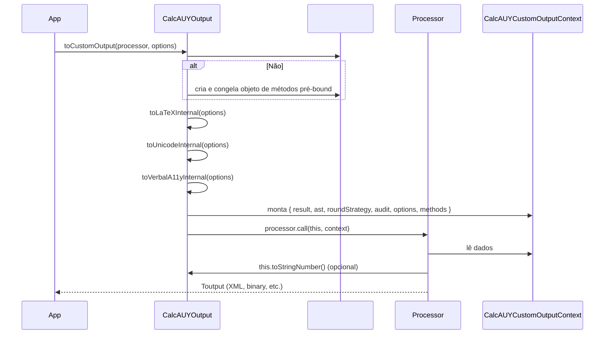

# 16 - Processadores de Saída Customizados (Extensibilidade)


## 1. Interface Funcional

`src/output_internal/types.ts:35-38` — A assinatura base para processadores customizados:

```typescript
export type CalcAUYCustomOutput<Toutput, Toptions extends OutputOptions = OutputOptions> = (
    this: CalcAUYOutput,
    context: CalcAUYCustomOutputContext<Toptions>,
) => Toutput;
```

**Parâmetros genéricos**:

| Parâmetro | Descrição |
|-----------|-----------|
| `Toutput` | Tipo de retorno do processador (livre: `string`, `Uint8Array`, `XMLDocument`, etc.) |
| `Toptions` | Tipo das opções customizadas; deve estender `OutputOptions` |

O `this` é vinculado à instância `CalcAUYOutput`, permitindo acesso a campos privados via métodos públicos.

## 2. Contexto do Processador

`src/output_internal/types.ts:48-80` — `CalcAUYCustomOutputContext` fornece todos os dados necessários para gerar qualquer formato de saída:

```typescript
export type CalcAUYCustomOutputContext<Toptions extends OutputOptions = OutputOptions> = {
    /** O valor final consolidado em forma racional absoluta (n/d como BigInt). */
    result: RationalNumber;

    /** A árvore de sintaxe completa para reconstrução customizada. */
    ast: CalculationNode;

    /** A estratégia de arredondamento aplicada no commit. */
    roundStrategy: RoundingStrategy;

    /** Rastros auditáveis pré-gerados (cálculo sob demanda, cacheados por options). */
    audit: {
        latex: string;
        unicode: string;
        verbal: string;
    };

    /** Opções de saída ativas (somente leitura). */
    options: Readonly<Toptions>;

    /** Referências pré-bound para todos os métodos de exportação padrão da CalcAUYOutput. */
    methods: Pick<CalcAUYOutput,
        | "toStringNumber" | "toScaledBigInt" | "toRawInternalNumber"
        | "toLiveTrace" | "toMonetary" | "toLaTeX" | "toUnicode"
        | "toMermaidGraph" | "toVerbalA11y" | "toSlice" | "toSliceByRatio"
        | "toAuditTrace" | "toJSON"
    >;
};
```

### 2.1 Detalhamento dos Campos

| Campo | Tipo | Descrição |
|-------|------|-----------|
| `result` | `RationalNumber` | Objeto com `n: bigint` e `d: bigint` — o valor exato sem arredondamento |
| `ast` | `CalculationNode` | AST completa: `LiteralNode`, `OperationNode`, `GroupNode`, `ControlNode` |
| `roundStrategy` | `RoundingStrategy` | `"NBR5891"`, `"HALF_UP"`, `"HALF_EVEN"`, `"TRUNCATE"`, `"CEIL"`, `"NONE"` |
| `audit.latex` | `string` | Representação LaTeX pré-renderizada via `renderAST(ast, "latex")` |
| `audit.unicode` | `string` | Representação Unicode (CLI-friendly) via `renderAST(ast, "unicode")` |
| `audit.verbal` | `string` | Descrição textual A11y via `renderAST(ast, "verbal", loc)` |
| `options` | `Readonly<Toptions>` | Opções passadas pelo usuário (congeladas) |
| `methods` | objeto | Todos os métodos públicos de `CalcAUYOutput` pré-bound à instância |

## 3. Método de Ativação (`toCustomOutput()`)

`src/output.ts:626-663` — Ponto de entrada para execução do processador:

```typescript
public toCustomOutput<Toutput, Toptions extends OutputOptions = OutputOptions>(
    processor: CalcAUYCustomOutput<Toutput, Toptions>,
    options: Toptions = {} as Toptions,
): Toutput {
    using _span = startSpan("toCustomOutput", logger, options);

    // Cache de métodos pré-bound (singleton por instância)
    if (!this.#cachedMethods) {
        this.#cachedMethods = Object.freeze({
            toStringNumber: this.toStringNumber.bind(this),
            toScaledBigInt: this.toScaledBigInt.bind(this),
            toRawInternalNumber: this.toRawInternalNumber.bind(this),
            toLiveTrace: this.toLiveTrace.bind(this),
            toMonetary: this.toMonetary.bind(this),
            toLaTeX: this.toLaTeX.bind(this),
            toUnicode: this.toUnicode.bind(this),
            toMermaidGraph: this.toMermaidGraph.bind(this),
            toVerbalA11y: this.toVerbalA11y.bind(this),
            toSlice: this.toSlice.bind(this),
            toSliceByRatio: this.toSliceByRatio.bind(this),
            toAuditTrace: this.toAuditTrace.bind(this),
            toJSON: this.toJSON.bind(this),
        });
    }

    const context: CalcAUYCustomOutputContext<Toptions> = {
        result: this.#result,
        ast: this.#ast,
        roundStrategy: this.#roundStrategy,
        audit: {
            latex: this.toLaTeXInternal(options),
            unicode: this.toUnicodeInternal(options),
            verbal: this.toVerbalA11yInternal(options),
        },
        options,
        methods: this.#cachedMethods,
    };

    return processor.call(this, context);
}
```

### 3.1 Fluxo de Execução

1. **Cache de métodos**: `#cachedMethods` é populado apenas uma vez (lazy), congelando um objeto com todos os métodos de exportação pré-bound à instância (`bind(this)`). Isso evita realocação em múltiplas chamadas.
2. **Geração de audit traces**: `toLaTeXInternal()`, `toUnicodeInternal()` e `toVerbalA11yInternal()` são chamados com as `options` fornecidas. Cada um usa seu próprio cache interno (`#outputCache`) para evitar recomputação.
3. **Chamada do processador**: `processor.call(this, context)` — o `this` do processador é a instância `CalcAUYOutput`, permitindo acesso a qualquer método público sem passar pelo objeto `methods`.

## 4. Exemplo: Processador XML

```typescript
import { CalcAUY } from "@st-all-one/calc-auy";
import type { CalcAUYCustomOutput, CalcAUYCustomOutputContext } from "@st-all-one/calc-auy";

// Definição do tipo de opções (estende OutputOptions)
type XMLOptions = { rootElement?: string; indent?: number };

// Implementação do processador
const xmlProcessor: CalcAUYCustomOutput<string, XMLOptions> = function (context) {
    const { result, ast, roundStrategy, audit, options } = context;
    const root = options.rootElement ?? "calculation";
    const indent = options.indent ?? 2;
    const sp = " ".repeat(indent);

    let xml = `<?xml version="1.0" encoding="UTF-8"?>\n`;
    xml += `<${root}>\n`;
    xml += `${sp}<result>\n`;
    xml += `${sp}${sp}<n>${result.n}</n>\n`;
    xml += `${sp}${sp}<d>${result.d}</d>\n`;
    xml += `${sp}${sp}<decimal>${this.toStringNumber()}</decimal>\n`;
    xml += `${sp}</result>\n`;
    xml += `${sp}<roundStrategy>${roundStrategy}</roundStrategy>\n`;
    xml += `${sp}<latex><![CDATA[${audit.latex}]]></latex>\n`;
    xml += `</${root}>`;

    return xml;
};

// Uso
const calc = CalcAUY.create({ contextLabel: "xml-export", salt: "dev" });
const result = await calc.from("1/3").add("0.5").commit();
const xml = result.toCustomOutput(xmlProcessor, { rootElement: "tax-calculation", indent: 4 });
console.log(xml);
```

## 5. Exemplo: Processador Binário (Blockchain Proof)

```typescript
import { CalcAUY } from "@st-all-one/calc-auy";
import type { CalcAUYCustomOutput } from "@st-all-one/calc-auy";

type ProofOptions = { networkId: number; timestamp?: number };

const blockchainProofProcessor: CalcAUYCustomOutput<Uint8Array, ProofOptions> = function (context) {
    const { result, ast, roundStrategy, audit, options } = context;

    // Cabeçalho binário: 4 bytes networkId + 8 bytes timestamp + 1 byte strategy
    const header = new ArrayBuffer(13);
    const view = new DataView(header);
    view.setUint32(0, options.networkId, false);       // big-endian
    view.setFloat64(4, options.timestamp ?? Date.now(), false);

    // Strategy ID
    const strategyMap: Record<string, number> = {
        NBR5891: 0, HALF_UP: 1, HALF_EVEN: 2,
        TRUNCATE: 3, CEIL: 4, NONE: 5,
    };
    view.setUint8(12, strategyMap[roundStrategy] ?? 0);

    // Serializa n/d como strings UTF-8
    const encoder = new TextEncoder();
    const nBytes = encoder.encode(result.n.toString());
    const dBytes = encoder.encode(result.d.toString());

    // Monta payload: header + n_length(4) + n_bytes + d_length(4) + d_bytes
    const payload = new Uint8Array(header.byteLength + 4 + nBytes.length + 4 + dBytes.length);
    payload.set(new Uint8Array(header), 0);

    let offset = 13;
    payload.set(new Uint8Array(new Uint32Array([nBytes.length]).buffer), offset); offset += 4;
    payload.set(nBytes, offset); offset += nBytes.length;
    payload.set(new Uint8Array(new Uint32Array([dBytes.length]).buffer), offset); offset += 4;
    payload.set(dBytes, offset);

    return payload;
};
```

## 6. Processadores Oficiais

O ecossistema CalcAUY inclui processadores empacotados como submódulos do JSR:

| Processador | Caminho | Formato |
|-------------|---------|---------|
| Protobuf | `@st-all-one/calc-auy/protobuffer` | `Uint8Array` (Protocol Buffers) |
| CBOR | `@st-all-one/calc-auy/cbor` | `Uint8Array` (RFC 7049) |
| MsgPack | `@st-all-one/calc-auy/msgpack` | `Uint8Array` (MessagePack) |
| HTML | `@st-all-one/calc-auy/html` | `string` (documento HTML semântico) |
| Image | `@st-all-one/calc-auy/image-buffer` | `Uint8Array` (PNG renderizado) |
| Persistence | `@st-all-one/calc-auy/persistence` | `string` (JSON + schemas relacionais) |

## 7. Contrato e Boas Práticas

### 7.1 Regras de Implementação

1. **Processadores devem ser funções puras** (exceto pelo acesso a `this`): para uma mesma entrada + mesmas options, devem produzir a mesma saída.
2. **Não modificar o contexto**: `context.result`, `context.ast` e `context.options` são somente leitura por contrato. O congelamento de `options` é enforcement via `Readonly<T>`.
3. **Usar `this` para métodos padrão**: `this.toStringNumber()` respeita a configuração de arredondamento; usar `result` bruto pode gerar valores não arredondados.
4. **Cache**: O método `toCustomOutput` cacheia os métodos pré-bound (`#cachedMethods`). Os audit traces também são cacheados individualmente. Para dados específicos do processador, implemente cache próprio via WeakMap ou Map.

### 7.2 Acesso ao RationalNumber Bruto

O campo `result` expõe `n` e `d` como `bigint`. Para obter o valor arredondado, use `this.toStringNumber(options)` ou `this.toScaledBigInt(options)` via `methods` ou `this`.

```typescript
// Acesso bruto (sem arredondamento)
const rawN = context.result.n;   // bigint
const rawD = context.result.d;   // bigint

// Acesso arredondado (respeita roundStrategy)
const formatted = context.methods.toStringNumber({ decimalPrecision: 4 });
// ou via this (mesma instância)
const formatted2 = this.toStringNumber({ decimalPrecision: 4 });
```

## 8. Diagrama de Sequência



## 9. Referências

| Arquivo | Linhas | Conteúdo |
|---------|--------|----------|
| `src/output_internal/types.ts` | 35–80 | `CalcAUYCustomOutput`, `CalcAUYCustomOutputContext`, `OutputOptions` |
| `src/output_internal/types.ts` | 89–163 | `CalcAUYLocaleA11y` |
| `src/output.ts` | 626–663 | `toCustomOutput()` |
| `src/output.ts` | 57–62 | Campos privados (`#result`, `#ast`, `#roundStrategy`, `#cachedMethods`) |
| `src/core/rational.ts` | 1–60 | `RationalNumber` (n, d como bigint) |
| `src/ast/types.ts` | 1–97 | Tipos da AST |
| `src/core/constants.ts` | 19–28 | `RoundingStrategy` e `ROUNDING_IDS` |

---

[↑ Voltar ao índice](../../index.md)
