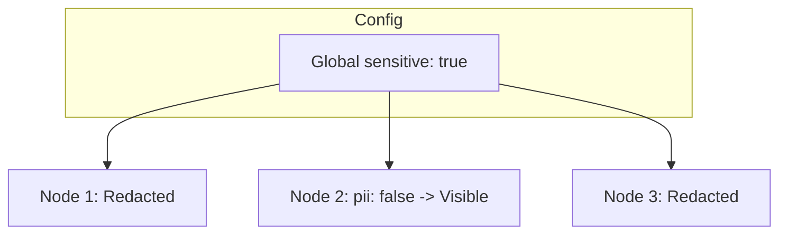

# Especificação Técnica 17: Política de Proteção de PII e Integridade



A CalcAUY implementa um sistema de proteção de dados sensíveis (Personally Identifiable Information) e integridade forense em camadas, agora operando sob o modelo de **Jurisdições Isoladas**.

## Camada 1: Política por Instância (`create`)

O controle de segurança é definido no momento da criação da jurisdição. Não existe mais estado global, garantindo que diferentes módulos do sistema possam ter níveis de restrição distintos.

-   **Método:** `CalcAUY.create(config: InstanceConfig)`
-   **Configuração Padrão:** `{ sensitive: true, salt: "", encoder: "HEX" }`

### Comportamento da Redação (sensitive: true)
Quando ativado na instância, os utilitários de log e erro substituem automaticamente:
1.  **Valores Numéricos:** O numerador (`n`) e denominador (`d`) são substituídos por `[PII]`.
2.  **Input Original:** O campo `originalInput` é ofuscado.
3.  **Metadados de Negócio:** Redigidos para `[PII]`.

### Exceções Técnicas (Visibilidade Garantida)
Para garantir a auditabilidade do rastro técnico, os metadados do nó `control` (**timestamp**, **previousContextLabel** e **previousSignature**) **NUNCA** são redigidos, permitindo que a linhagem do dado seja rastreada mesmo em modo restrito.

## Camada 2: Controle Granular via Metadata (`pii`)

O desenvolvedor pode marcar nós individuais da AST para forçar ou liberar a visibilidade.

-   **Ocultação Forçada:** `.setMetadata("pii", true)` - Garante que o dado NUNCA apareça em logs.
-   **Liberação de Visibilidade:** `.setMetadata("pii", false)` - Permite que constantes públicas (ex: alíquota de 18%) apareçam nos logs técnicos mesmo em jurisdições sensíveis.

## Camada 3: Herança de Sensibilidade (PII Propagation)

Para otimizar a experiência do desenvolvedor e garantir a segurança por padrão, a CalcAUY implementa um mecanismo de propagação de políticas na árvore:

1.  **Herança de Nós Literais:** Se um nó `literal` não possuir um override explícito de metadado `pii`, ele **herda automaticamente** o estado de ocultação do seu nó pai (`group`, `operation` ou `control`).
2.  **Propagação em Cascata:** Isso permite que, ao marcar uma operação complexa como sensível, todos os seus componentes internos sejam protegidos recursivamente, a menos que uma liberação explícita (`pii: false`) seja encontrada em um sub-nó.
3.  **Segurança em Handover:** Durante integrações cross-context, o nó `control` atua como uma barreira ou ponte, mantendo a sensibilidade da jurisdição de origem a menos que o contrato de integração especifique o contrário.

---

## Exemplo de Fluxo Isolado

```typescript
// 1. Jurisdição Segura
const Secure = CalcAUY.create({ contextLabel: "bank", sensitive: true, salt: "S1" });

// 2. Jurisdição Pública
const Public = CalcAUY.create({ contextLabel: "gov", sensitive: false, salt: "S2" });

const s = Secure.from(5000); // Oculto nos logs
const p = Public.from(0.18); // Visível nos logs
```
