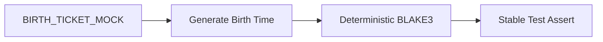

# 18 - Testes Determinísticos e Snapshot de Assinaturas



## Objetivo
Estabelecer o protocolo para garantir a reprodutibilidade de assinaturas digitais em ambientes de teste, permitindo o uso de snapshots e testes de regressão criptográfica na CalcAUY.

## 1. O Desafio dos Timestamps
A CalcAUY injeta um `timestamp` de fechamento no momento do `commit()` ou `hibernate()`. Como a assinatura BLAKE3 depende do conteúdo da árvore (incluindo metadados), assinaturas geradas em momentos diferentes para o mesmo cálculo seriam divergentes, impossibilitando testes determinísticos.

## 2. O Mecanismo `BIRTH_TICKET_MOCK`
A biblioteca utiliza um `unique symbol` interno para permitir a injeção controlada de tempo em jurisdições de teste.

- **Símbolo:** `BIRTH_TICKET_MOCK` (não exportado publicamente para evitar uso acidental em produção).
- **Funcionamento:** Se este símbolo estiver presente na configuração da instância, o motor de nascimento ignora o `new Date()` e utiliza o valor fornecido.

### Exemplo de Uso em Testes
```typescript
import { BIRTH_TICKET_MOCK } from "./src/core/constants.ts";

const TestJurisdiction = CalcAUY.create({
    contextLabel: "test",
    salt: "fixed-salt",
    [BIRTH_TICKET_MOCK]: "2026-05-03T10:00:00.000Z"
});

const res = await TestJurisdiction.from(100).commit();
// A assinatura será SEMPRE a mesma, permitindo snapshoting.
assertEquals(res.toAuditTrace().signature, "expected_stable_hash...");
```

## 3. Boas Práticas
1. **Isolamento de Teste:** O mock de tempo deve ser usado apenas em suítes de teste que validam a integridade da assinatura.
2. **Sais Estáticos:** Além do tempo, utilize salts estáticos em testes para garantir que o hash seja previsível.
3. **Cadeia de Custódia:** Em testes de integração cross-context, o mock garante que a linhagem de tempo entre jurisdições (handover) seja estável.

## 4. Benefícios
- **Snapshot Testing:** Permite salvar o JSON completo da auditoria em arquivos de referência.
- **CI/CD Determinístico:** Garante que os testes não falhem devido a latências milimétricas na execução do runner.
