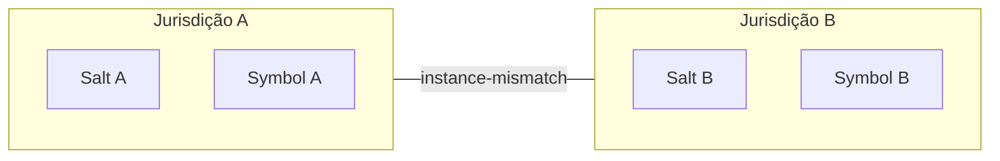

# 20 - Controle e Segurança de Instâncias (Jurisdição)



## Objetivo
Estabelecer o protocolo de isolamento militar entre universos de cálculo da CalcAUY, garantindo que dados de diferentes domínios de negócio nunca se misturem sem um portal explícito e auditável.

## 1. Padrão Factory (`CalcAUY.create`)
A biblioteca abandona o estado global em favor de um modelo baseado em instâncias isoladas. Cada chamada ao método `create()` gera uma nova jurisdição com seu próprio segredo (salt) e codificador.

### Parâmetros de Lacre:
- **`contextLabel`**: Identificador nominal da jurisdição. Usado para logs e rastros técnicos.
- **`salt`**: Chave privada de assinatura. Define a identidade criptográfica da instância.
- **`sensitive`**: Define se a jurisdição opera sob redação automática de PII.

## 2. Mecanismo de Identidade Dual

O isolamento é garantido em duas camadas independentes:

### A. Camada de Runtime (Identity Symbols)
Cada instância possui um `unique symbol` gerado internamente:
- **Unicidade Absoluta:** No JavaScript, um `Symbol()` nunca é igual a outro, mesmo que tenham a mesma descrição.
- **Validação de Operação:** Todos os métodos (`add`, `mult`, etc.) verificam a igualdade referencial do Symbol antes de aceitar um operando do tipo `CalcAUYLogic`. Se os Symbols divergirem, o sistema lança `instance-mismatch`.

### B. Camada de IDE (Branding Types)
Utiliza o recurso de **Const Type Parameters** para capturar a literalidade da configuração:
- **Diferenciação Estática:** O TypeScript enxerga instâncias com configurações diferentes como tipos incompatíveis.
- **Segurança Antecipada:** Se o desenvolvedor tentar somar `Calc(salt: "A")` com `Calc(salt: "B")`, a IDE acusará erro visual antes mesmo da execução.

## 3. Portal de Integração Cross-Context
O método `addFromExternalInstance` é o único portal legítimo para a união de jurisdições.

### Protocolo de Handshake:
1. **Lacre Imediato:** Se a instância externa estiver "viva", ela é imediatamente assinada via `hibernate()`.
2. **Validação de Fronteira:** O rastro externo é validado contra o segredo daquela instância específica.
3. **Envelopamento de Jurisdição:** A árvore externa é envolvida em um nó do tipo `control`.
4. **Operação Segura:** A união é feita via `crossContextAdd`, protegida por um `GroupNode` automático.

## 4. O Nó de Controle (`control`)
Diferente de operações matemáticas, o nó `control` é um carimbo de linhagem forense que marca a entrada de dados externos ou a reanimação de um cálculo.

### Metadados de Jurisdição:
- **`previousContextLabel`**: Nome da jurisdição de onde o dado veio.
- **`previousSignature`**: Assinatura original do dado antes da integração.

## 5. Lacre de Fechamento (Timestamp Jurídico)
A CalcAUY implementa o conceito de **Certidão de Fechamento**. Embora o momento de nascimento do cálculo seja capturado em sua inicialização (via `.from()`, `.parseExpression()` ou `.fromExternalInstance()`), a injeção física deste `timestamp` nos metadados do nó raiz da AST ocorre **exclusivamente** no ato de encerramento (`commit`) ou persistência (`hibernate`).

### Imutabilidade Temporal:
- **Preservação da Fase de Build:** Durante a fase de construção, os nós permanecem puros e sem carimbos de tempo redundantes, otimizando o rastro técnico.
- **Proteção por Assinatura:** O timestamp é injetado **imediatamente antes** da geração da assinatura digital BLAKE3. Isso o torna parte integrante do lacre criptográfico; qualquer tentativa de retroagir ou alterar o momento do fechamento invalidará a assinatura.
- **Linhagem Preservada:** Em integrações cross-context, o nó `control` aponta para a árvore filha que já possui seu próprio timestamp de fechamento original, permitindo reconstruir a linha do tempo exata de cada jurisdição que contribuiu para o cálculo.

## 5. Matriz de Segurança de Jurisdição

| Cenário | Resultado IDE | Resultado Runtime | Mecanismo |
| :--- | :--- | :--- | :--- |
| Mesma Instância | ✅ Sucesso | ✅ Sucesso | Identidade Referencial |
| Labels Iguais / Instâncias Diferentes | ✅ Sucesso* | ❌ `instance-mismatch` | Symbols Divergentes |
| Configurações Diferentes (Salt/Sensitive) | ❌ Type Error | ❌ `instance-mismatch` | Literal Branding |
| Integração via Portal | ✅ Sucesso | ✅ Sucesso | Nó `control` |

*\*Nota: Se os labels forem idênticos e o dev não usar tipos literais explícitos, a proteção de runtime por Symbol é a guarda final.*

## 6. Impacto na Auditoria
O rastro gerado por `toAuditTrace()` revela toda a história do dado:
```json
{
  "kind": "operation",
  "type": "crossContextAdd",
  "operands": [
    { "kind": "literal", "value": "100" },
    {
      "kind": "group",
      "child": {
        "kind": "control",
        "metadata": {
          "previousContextLabel": "logistic",
          "previousSignature": "blake3_hash..."
        },
        "child": { "kind": "literal", "value": "50" }
      }
    }
  ]
}
```
Isso garante que um auditor saiba exatamente que o valor `50` não foi gerado pela jurisdição atual, mas sim importado de um rastro assinado pela jurisdição "Logística".
