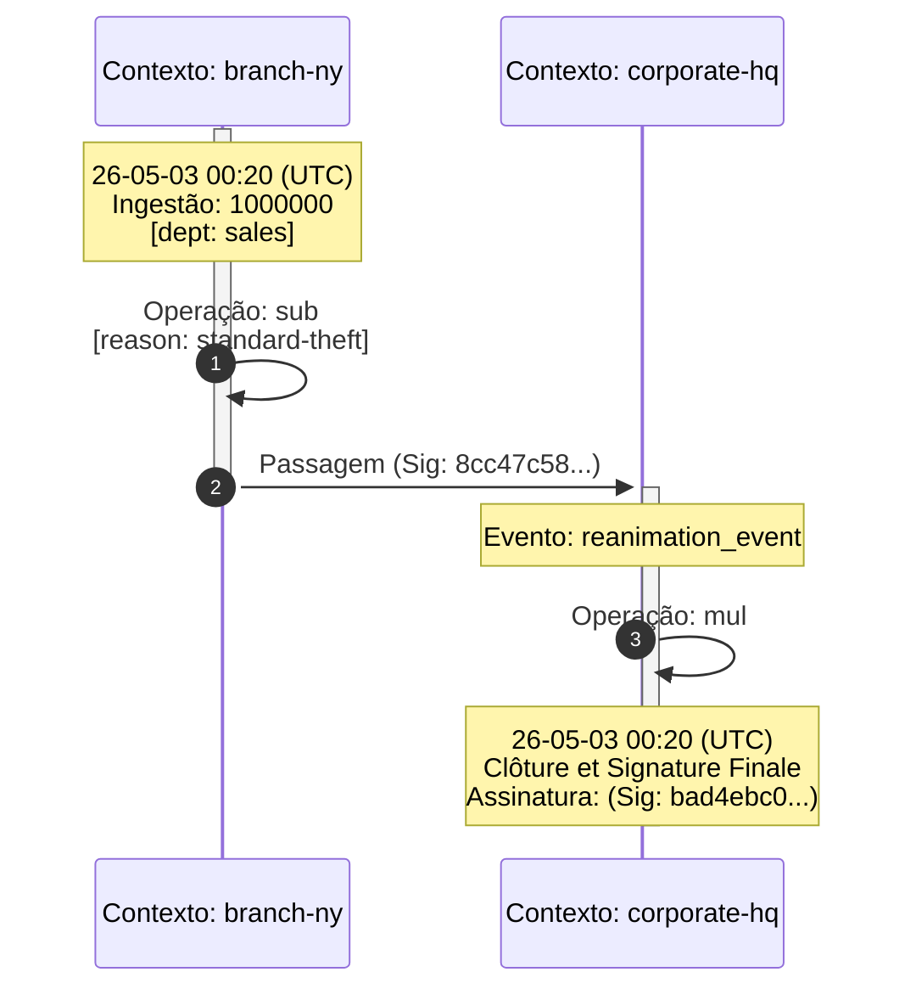

# 21 - Auditoria de Linhagem Visual (Mermaid Sequence Ledger)

## Ponto de Entrada

`CalcAUYOutput.toMermaidGraph(options?)` em `src/output.ts:386-400` delega para `renderMermaidSequence()` em `src/output_internal/mermaid_sequence_renderer.ts:25-249`.

```typescript
// src/output.ts:386-400
public toMermaidGraph(options?: OutputOptions): string {
    using _span = startSpan("toMermaidGraph", logger, options);
    return this.toMermaidGraphInternal(options);
}
private toMermaidGraphInternal(options?: OutputOptions): string {
    const loc = getLocale(options?.locale);
    const cacheKey = `toMermaidGraph:${loc.locale}`;
    let graph = this.#outputCache.get(cacheKey) as string;
    if (graph === undefined) {
        graph = renderMermaidSequence(this.#ast, this.#config, this.#signature, loc);
        this.#outputCache.set(cacheKey, graph);
    }
    return graph;
}
```

A assinatura do motor de renderização:

```typescript
// src/output_internal/mermaid_sequence_renderer.ts:25-30
export function renderMermaidSequence(
    ast: CalculationNode,
    config: Required<InstanceConfig>,
    finalSignature: string,
    loc: CalcAUYLocaleA11y,
): string
```

## Algoritmo de Varredura Recursiva

A função `walk(node, ctx, depth, isRoot?)` (`mermaid_sequence_renderer.ts:137-193`) percorre a AST em profundidade e povoa duas estruturas:

1. **`events: MermaidSequenceEvent[]`** — lista linear de eventos cronológicos.
2. **`participantDepths: Map<string, number>`** — profundidade máxima de cada participante para ordenação.

```typescript
type MermaidSequenceEvent = {
    type: "note" | "transition" | "action";
    context: string;
    message: string;
    fromContext?: string;
    metadata?: string;
};
```

### Comportamento por tipo de nó

| Tipo de Nó | Ação |
|------------|------|
| `literal` | Acumula no `literalBuffer[]` com timestamp e metadados de usuário. |
| `operation` | Varre recursivamente os `operands`, depois chama `flushLiterals(ctx)`, emite evento `action` (self-call). |
| `group` | Apenas delega recursivamente ao `child`. |
| `control` | Descarrega literais, varre `child` no **contexto anterior** (`previousContextLabel`), descarrega literais do contexto anterior, emite `transition` com assinatura truncada, emite `note` com `type` do control node. |

### `flushLiterals(ctx)` — Agrupamento Inteligente

```typescript
// mermaid_sequence_renderer.ts:105-132
function flushLiterals(ctx: string): void {
    if (literalBuffer.length === 0) return;
    if (literalBuffer.length === 1) {
        // Nota individual
        events.push({
            type: "note", context: ctx,
            message: `${timePrefix}${loc.mermaid.ingestion}: ${lit.input}...`,
        });
    } else {
        // Nota agrupada com bullets
        events.push({
            type: "note", context: ctx,
            message: `${timePrefix}${loc.mermaid.ingestionOperands}:<br/>• val1<br/>• val2...`,
        });
    }
    literalBuffer = [];
}
```

Se o buffer tiver 1 item → nota simples com rótulo `ingestion`. Se tiver múltiplos → nota composta com `ingestionOperands` e lista com bullets `<br/>•`. Isso produz diagramas compactos mesmo para `from(1).add(2).add(3).add(4)` — os quatro literais aparecem como uma única nota agrupada.

## Ordenação Cronológica

A ordenação dos participantes é por profundidade **decrescente**:

```typescript
// mermaid_sequence_renderer.ts:209-211
const sortedParticipants = Array.from(participantDepths.entries())
    .sort((a, b) => b[1] - a[1])
    .map(([name]) => name);
```

Como o contexto pai tem profundidade 0 e contextos importados (`control`) têm profundidade incremental, contextos mais "profundos" (importados) aparecem primeiro no diagrama, criando uma leitura cronológica natural: o contexto importado executa, depois passa o controle ao contexto atual.

## Estrutura DSL Gerada



O gerador produz sequência exata de DSL:

1. **Cabeçalho**: `sequenceDiagram\n    autonumber\n`
2. **Participantes**: `participant Ctx_Alias as "Contexto: label"` — ordenados por profundidade descendente.
3. **Eventos**:
   - `activate Ctx_A` — ativação na primeira menção.
   - `Ctx_A->>+Ctx_B: handover` — transição com ativação do destino.
   - `deactivate Ctx_A` — desativação da origem após transição.
   - `Ctx_B->>Ctx_B: operation` — self-call para operações.
   - `Note over Ctx_B: texto` — notas com timestamp, ingestão, metadados.
4. **Nota de fechamento**: sempre emitida no contexto raiz com o timestamp, rótulo `closing`, e assinatura truncada.
5. **Desativação final**: `deactivate Ctx` para todos os restantes.

## Internacionalização (i18n)

Todos os textos visíveis vêm do dicionário `loc.mermaid` por locale:

```typescript
// Extraído do dicionário i18n (src/output_internal/i18n.ts)
{
    mermaid: {
        context: "Contexto" | "Context" | "Contexte" | "Kontext" | "コンテキスト",
        handover: "Passagem" | "Handover" | "Passage" | "Übergabe" | "引き継ぎ",
        ingestion: "Ingestão" | "Ingestion" | "Ingestion" | "Eingabe" | "取り込み",
        ingestionOperands: "Ingestão de Operandos" | "Ingestion of Operands" | ...,
        operation: "Operação" | "Operation" | "Opération" | "Operation" | "操作",
        event: "Evento" | "Event" | "Événement" | "Ereignis" | "イベント",
        closing: "Clôture et Signature Finale" | "Final Closing and Signature" | ...,
        signature: "Assinatura" | "Signature" | "Signature" | "Unterschrift" | "署名",
        today: "hoje" | "today" | "aujourd'hui" | "heute" | "今日",
        listTemplate: "[{n} itens]" | "[{n} items]" | ...,
        objectLabel: "[Objeto]" | "[Object]" | "[Objet]" | "[Objekt]" | "[オブジェクト]",
    }
}
```

Locais suportados: `pt-BR`, `en-US`, `en-EU`, `es-ES`, `fr-FR`, `de-DE`, `ru-RU`, `zh-CN`, `ja-JP`.

## Redação de PII

Valores sensíveis são substituídos por `[REDACTED]` seguindo a política da instância:

```typescript
// mermaid_sequence_renderer.ts:140-141
const isPII = typeof meta.pii === "boolean" ? meta.pii : config.sensitive !== false;
// ...
if (node.kind === "literal") {
    const input = isPII ? "[REDACTED]" : node.originalInput;
}
```

A política é herdada do `#config.sensitive` da instância, com override por nó via metadado `pii`. Literais em árvores marcadas como `sensitive: true` têm seu `originalInput` substituído por `[REDACTED]`.

## Alias de Participantes

```typescript
// mermaid_sequence_renderer.ts:251-253
function getAlias(name: string): string {
    return "Ctx_" + name.replace(/[^a-zA-Z0-9]/g, "_");
}
```

Remove caracteres especiais para garantir identificadores Mermaid válidos. Exemplo: `"branch-ny"` → `Ctx_branch_ny`.

## Formatação de Timestamp

```typescript
// mermaid_sequence_renderer.ts:55-72
function formatTime(iso?: MetadataValue): string {
    if (typeof iso !== "string") return "";
    const d = new Date(iso);
    if (isNaN(d.getTime())) return "";
    const yy = String(d.getUTCFullYear()).slice(-2);
    const MM = String(d.getUTCMonth() + 1).padStart(2, "0");
    const dd = String(d.getUTCDate()).padStart(2, "0");
    const hh = String(d.getUTCHours()).padStart(2, "0");
    const mm = String(d.getUTCMinutes()).padStart(2, "0");
    return `${yy}-${MM}-${dd} ${hh}:${mm} (UTC)`;
}
```

Formato compacto `YY-MM-DD HH:mm (UTC)` para caber nas notas do diagrama.

## Cache de Saída

O resultado de `toMermaidGraph` é cacheado por locale em `CalcAUYOutput.#outputCache` (`src/output.ts:58`). A chave é `toMermaidGraph:${loc.locale}`. Isso garante que múltiplas chamadas com o mesmo locale não re-renderizem o diagrama.

## Exemplo Real (Cross-Context)

```typescript
// Extraído de src/builder.ts docstring:454-487
const Court_A = CalcAUY.create({ contextLabel: "regional-court", salt: "justice-key-1" });
const basePenalty = Court_A.from(30).setMetadata("reason", "standard-theft");
const verdict_A = await basePenalty.hibernate();

const Court_B = CalcAUY.create({ contextLabel: "appellate-court", salt: "justice-key-2", sensitive: false });
const appealReview = await Court_B.fromExternalInstance(verdict_A);
const finalVerdict = await appealReview.mult(1.5).setMetadata("aggravator", "recidivism").commit();

console.log(finalVerdict.toMermaidGraph({ locale: "fr-FR" }));
```

Produz diagrama com dois participantes, transição com assinatura truncada, e notas em francês.

## Referência de Código

- `src/output.ts:386-400` — `toMermaidGraph()` com cache
- `src/output_internal/mermaid_sequence_renderer.ts:25-30` — `renderMermaidSequence()` assinatura
- `src/output_internal/mermaid_sequence_renderer.ts:137-193` — `walk()` recursivo
- `src/output_internal/mermaid_sequence_renderer.ts:105-132` — `flushLiterals()` com agrupamento
- `src/output_internal/mermaid_sequence_renderer.ts:208-248` — Montagem DSL
- `src/output_internal/mermaid_sequence_renderer.ts:251-253` — `getAlias()`
- `src/output_internal/mermaid_sequence_renderer.ts:55-72` — `formatTime()`
- `src/output_internal/i18n.ts` — Dicionários de locale

[↑ Voltar ao índice](../../index.md)
